---
## Front matter
lang: ru-RU
title: Презентация по лабораторной работе №5.
subtitle: Основы информационной безопасности.
author:
  - Рогожина Н.А.
institute:
  - Российский университет дружбы народов, Москва, Россия

date: 13 апреля 2024

## i18n babel
babel-lang: russian
babel-otherlangs: english

## Formatting pdf
toc: false
toc-title: Содержание
slide_level: 2
aspectratio: 169
section-titles: true
theme: metropolis
header-includes:
 - \metroset{progressbar=frametitle,sectionpage=progressbar,numbering=fraction}
 - '\makeatletter'
 - '\beamer@ignorenonframefalse'
 - '\makeatother'
---

# Информация

## Докладчик

:::::::::::::: {.columns align=center}
::: {.column width="70%"}

  * Рогожина Надежда Александровна
  * Студентка 2го курса, НКАбд-02-22
  * Компьютерные и информационные науки
  * Российский университет дружбы народов
  * [Github](https://github.com/MikoGreen/study_2023-2024_infosec)

:::
::: {.column width="30%"}

:::
::::::::::::::

# Вводная часть

### Объект и предмет исследования

- Права доступа к каталогам и файлам

## Цели и задачи

Изучение механизмов изменения идентификаторов, применения SetUID- и Sticky-битов. Получение практических навыков работы в консоли с дополнительными атрибутами. Рассмотрение работы механизма смены идентификатора процессов пользователей, а также влияние бита Sticky на запись и удаление файлов.

# Выполнение лабораторной работы

## 

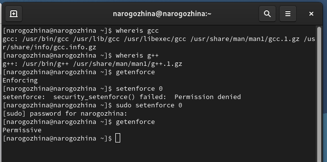{#fig:001 width=70%}

## 

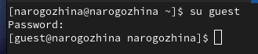{#fig:002 width=70%}

## 

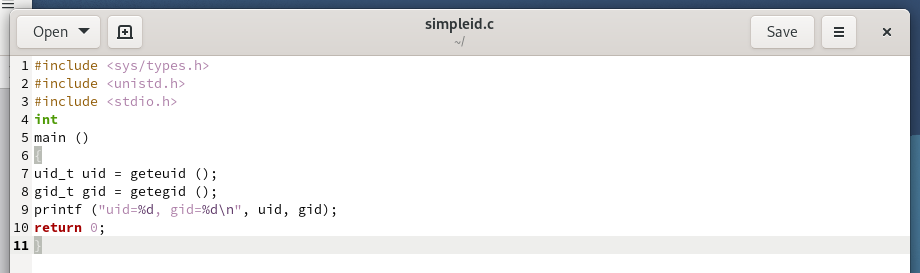{#fig:003 width=70%}

## 

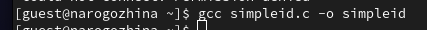{#fig:004 width=70%}

## 

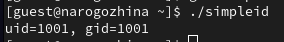{#fig:005 width=70%}

## 

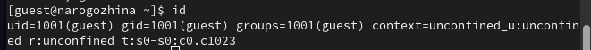{#fig:006 width=70%}

## 

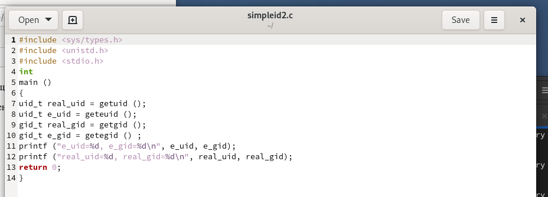{#fig:007 width=70%}

## 

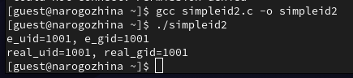{#fig:008 width=70%}

## 

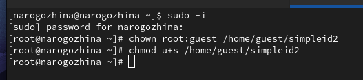{#fig:009 width=70%}

## 

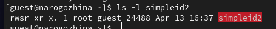{#fig:010 width=70%}

## 

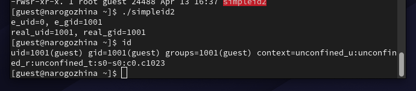{#fig:011 width=70%}

## 

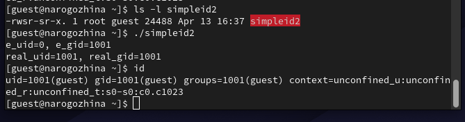{#fig:012 width=70%}

## 

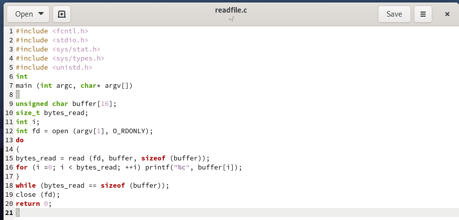{#fig:013 width=70%}

## 

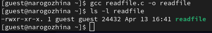{#fig:014 width=70%}

## 

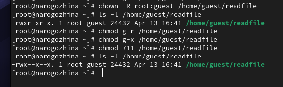{#fig:015 width=70%}

## 

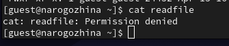{#fig:016 width=70%}

## 

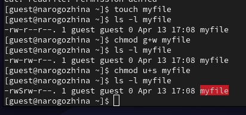{#fig:017 width=70%}

## 

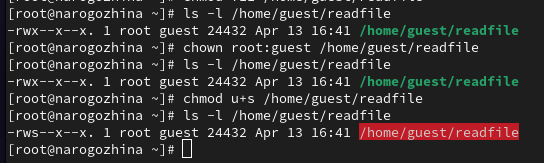{#fig:018 width=70%}

## 

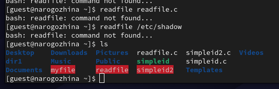{#fig:019 width=70%}

## 

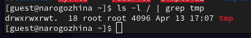{#fig:020 width=70%}

## 

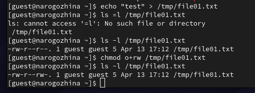{#fig:021 width=70%}

## 

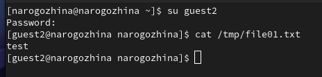{#fig:022 width=70%}

## 

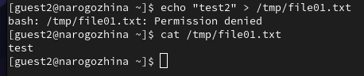{#fig:023 width=70%}

## 

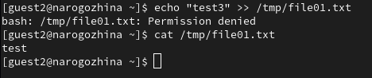{#fig:024 width=70%}

## 

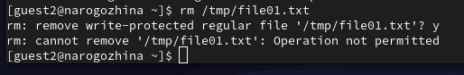{#fig:025 width=70%}

## 

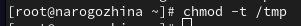{#fig:026 width=70%}

## 

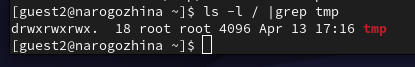{#fig:027 width=70%}

## 

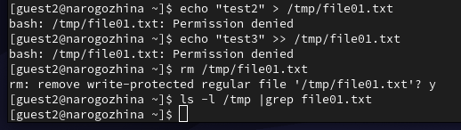{#fig:028 width=70%}

## 

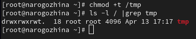{#fig:029 width=70%}

