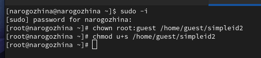

---
## Front matter
title: "Отчёт по лабораторной работе №5"
subtitle: "Основы информационной безопасности"
author: "Надежда Александровна Рогожина"

## Generic otions
lang: ru-RU
toc-title: "Содержание"

## Bibliography
bibliography: bib/cite.bib
csl: pandoc/csl/gost-r-7-0-5-2008-numeric.csl

## Pdf output format
toc: true # Table of contents
toc-depth: 2
lof: true # List of figures
lot: true # List of tables
fontsize: 12pt
linestretch: 1.5
papersize: a4
documentclass: scrreprt
## I18n polyglossia
polyglossia-lang:
  name: russian
  options:
	- spelling=modern
	- babelshorthands=true
polyglossia-otherlangs:
  name: english
## I18n babel
babel-lang: russian
babel-otherlangs: english
## Fonts
mainfont: PT Serif
romanfont: PT Serif
sansfont: PT Sans
monofont: PT Mono
mainfontoptions: Ligatures=TeX
romanfontoptions: Ligatures=TeX
sansfontoptions: Ligatures=TeX,Scale=MatchLowercase
monofontoptions: Scale=MatchLowercase,Scale=0.9
## Biblatex
biblatex: true
biblio-style: "gost-numeric"
biblatexoptions:
  - parentracker=true
  - backend=biber
  - hyperref=auto
  - language=auto
  - autolang=other*
  - citestyle=gost-numeric
## Pandoc-crossref LaTeX customization
figureTitle: "Рис."
tableTitle: "Таблица"
listingTitle: "Листинг"
lofTitle: "Список иллюстраций"
lotTitle: "Список таблиц"
lolTitle: "Листинги"
## Misc options
indent: true
header-includes:
  - \usepackage{indentfirst}
  - \usepackage{float} # keep figures where there are in the text
  - \floatplacement{figure}{H} # keep figures where there are in the text
---

# Цель работы

Изучение механизмов изменения идентификаторов, применения SetUID- и Sticky-битов. Получение практических навыков работы в консоли с дополнительными атрибутами. Рассмотрение работы механизма смены идентификатора процессов пользователей, а также влияние бита Sticky на запись и удаление файлов.

# Теоретическое введение

Setuid – это бит разрешения, который позволяет пользователю запускать исполняемый файл с правами владельца этого файла. Другими словами, использование этого бита позволяет нам поднять привилегии пользователя в случае, если это необходимо. Классический пример использования этого бита в операционной системе это команда sudo.

```
root@ruvds-hrc [~]# which sudo /usr/bin/sudo
root@ruvds-hrc [~]# ls -l /usr/bin/sudo
-rwsr-xr-x 1 root root 125308 Feb 20 14:15 /usr/bin/sudo
```
Как мы видим на месте, где обычно установлен классический бит x (на исполнение), у нас выставлен специальный бит s. Это позволяет обычному пользователю системы выполнять команды с повышенными привилегиями без необходимости входа в систему как root, разумеется зная пароль пользователя root.

Принцип работы Setgid очень похож на setuid с отличием, что файл будет запускаться пользователем от имени группы, которая владеет файлом. Иллюстрирует работу этого бита команда crontab:

```
root@ruvds-hrc [~]#  which crontab
/usr/bin/crontab
root@ruvds-hrc [~]#  ls -l /usr/bin/crontab
-rwxr-sr-x 1 root crontab 34021 Feb 12 2017 /usr/bin/crontab
```

Последний специальный бит разрешения – это Sticky Bit . В случае, если этот бит установлен для папки, то файлы в этой папке могут быть удалены только их владельцем. Пример использования этого бита в операционной системе это системная папка /tmp . Эта папка разрешена на запись любому пользователю, но удалять файлы в ней могут только пользователи, являющиеся владельцами этих файлов.

```
root@ruvds-hrc [~]#  ls -ld /tmp
drwxrwxrwt 8 root root 4096 Mar 25 10:22 /tmp
```

Символ «t» указывает, что на папку установлен Sticky Bit.

# Выполнение лабораторной работы

1. Войдем в систему от имени пользователя guest (рис. [-@fig:001], [-@fig:002]).

{#fig:001 width=70%}

{#fig:002 width=70%}

2. Создадим файл  `simpleid.c` (рис. [-@fig:003]).

{#fig:003 width=70%}

3. Скомпилируем и убедимся, что файл программы создан (рис. [-@fig:004], рис. [-@fig:002]).

{#fig:004 width=70%}

{#fig:005 width=70%}

4. Выполните системную команду `id` и сравните с результатом вывода нашей программы (рис. [-@fig:006]).

{#fig:006 width=70%}

5. Программа `simpleid2.c` (рис. [-@fig:007]).

{#fig:007 width=70%}

6. Компиляция и выполнение (рис. [-@fig:008]).

{#fig:008 width=70%}

7. Смена владельца и прав (рис. [-@fig:009]).

{#fig:009 width=70%}

8. Проверка (рис. [-@fig:010]).

{#fig:010 width=70%}

9. Запуск двух команд (рис. [-@fig:011]).

{#fig:011 width=70%}

10. То же самое, только для SetGID-бита (рис. [-@fig:012]).

{#fig:012 width=70%}

11. Программа `readfile` (рис. [-@fig:013]).

{#fig:013 width=70%}

12. Компиляция и проверка прав (рис. [-@fig:014]).

{#fig:014 width=70%}

13. Смена владельца и прав у `readfile` (рис. [-@fig:015]).

{#fig:015 width=70%}

14. Попытка прочитать (рис. [-@fig:016]).

{#fig:016 width=70%}

15. Пример работы `SetUID-бита` (рис. [-@fig:017]).

{#fig:017 width=70%}

16. Смена прав и владельца файла `readfile` (рис. [-@fig:018]).

{#fig:018 width=70%}

17. Попытка прочитать файлы (рис. [-@fig:019]).

{#fig:019 width=70%}

18. Права доступа директории `/tmp` (рис. [-@fig:020]).

{#fig:020 width=70%}

19. Попытка записи в новый файл и просмотр его атрибутов (рис. [-@fig:021]).

{#fig:021 width=70%}

20. Вход от имени guest2 (рис. [-@fig:022]).

{#fig:022 width=70%}

21. Попытка дозаписи в файл (рис. [-@fig:023]).

{#fig:023 width=70%}

22. Попытка перезаписи файла (рис. [-@fig:024]).

{#fig:024 width=70%}

23. Попытка удаления файла (рис. [-@fig:025]).

{#fig:025 width=70%}

24. Смена прав директории (рис. [-@fig:026]).

{#fig:026 width=70%}

25. Проверка (рис. [-@fig:027]).

{#fig:027 width=70%}

26. Повторение всех предыдущих действий (рис. [-@fig:028]).

{#fig:028 width=70%}

27. Возвращение прав обратно (рис. [-@fig:029]).

{#fig:029 width=70%}

# Выводы

В ходе работы мы изучили механизмы изменения идентификаторов, применения SetUID- и Sticky-битов, получили практические навыки работы в консоли с дополнительными атрибутами, а также рассмотрели работы механизма смены идентификатора процессов пользователей, а также влияние бита Sticky на запись и удаление файлов.

# Список литературы{.unnumbered}

::: {#refs}
:::
