---
## Front matter
lang: ru-RU
title: Презентация по лабораторной работе №6.
subtitle: Основы информационной безопасности.
author:
  - Рогожина Н.А.
institute:
  - Российский университет дружбы народов, Москва, Россия

date: 21 апреля 2024

## i18n babel
babel-lang: russian
babel-otherlangs: english

## Formatting pdf
toc: false
toc-title: Содержание
slide_level: 2
aspectratio: 169
section-titles: true
theme: metropolis
header-includes:
 - \metroset{progressbar=frametitle,sectionpage=progressbar,numbering=fraction}
 - '\makeatletter'
 - '\beamer@ignorenonframefalse'
 - '\makeatother'
---

# Информация

## Докладчик

:::::::::::::: {.columns align=center}
::: {.column width="70%"}

  * Рогожина Надежда Александровна
  * Студентка 2го курса, НКАбд-02-22
  * Компьютерные и информационные науки
  * Российский университет дружбы народов
  * [Github](https://github.com/MikoGreen/study_2023-2024_infosec)

:::
::: {.column width="30%"}

:::
::::::::::::::

# Цели работы

## Цели и задачи

- Развить навыки администрирования ОС Linux. Получить первое практическое знакомство с технологией SELinux1.
- Проверить работу SELinx на практике совместно с веб-сервером Apache.

# Выполнение лабораторной работы

## Вход в систему

1. Войдите в систему с полученными учётными данными и убедитесь, что SELinux работает в режиме enforcing политики targeted с помощью команд getenforce и sestatus.

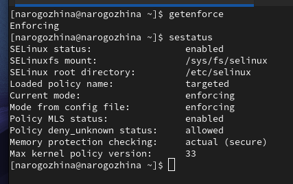{#fig:001 width=50%}

## Проверка работы сервера

2. Обратитесь с помощью браузера к веб-серверу, запущенному на вашем компьютере, и убедитесь, что последний работает `service httpd status`.

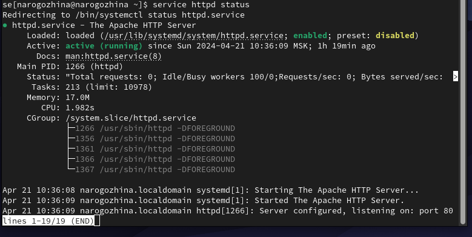{#fig:002 width=70%}

## Определение типов файлов и поддиректорий

3. Определите тип файлов и поддиректорий, находящихся в директории /var/www, с помощью команды `ls -lZ /var/www`.

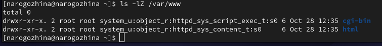{#fig:006 width=70%}

## Определение типов файлов и поддиректорий

4. Определите тип файлов, находящихся в директории /var/www/html `ls -lZ /var/www/html`. Создание файлов в директории /var/www/html разрешено только владельцу данной директории.

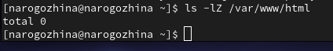{#fig:007 width=70%}

## Создание тестового файла

5. Создайте от имени суперпользователя (так как в дистрибутиве после установки только ему разрешена запись в директорию) html-файл `/var/www/html/test.html` следующего содержания:
```
<html>
<body>test</body>
</html>
```

## Создание тестового файла

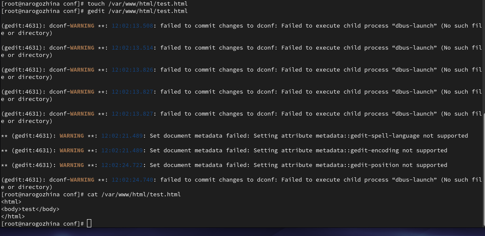{#fig:008 width=70%}

## Первое подключение

6. Обратитесь к файлу через веб-сервер, введя в браузере адрес http://127.0.0.1/test.html. Убедитесь, что файл был успешно отображён.

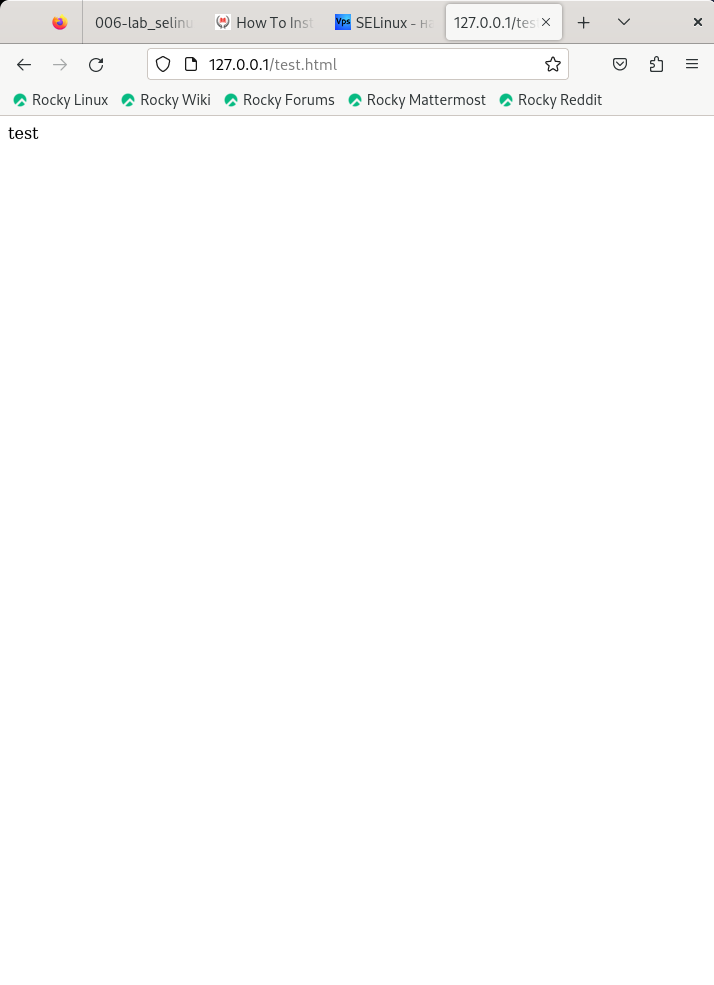{#fig:009 width=40%}

## Определение контекста файла

Контекст файла `test.html`: `unconfined_u:object_r:httpd_sys_content_t:s0`

## Изменение контекста файла

7. Измените контекст файла `/var/www/html/test.html` с `httpd_sys_content_t` на любой другой, к которому процесс httpd не должен иметь доступа, например, на `samba_share_t`: 
```
chcon -t samba_share_t /var/www/html/test.html
ls -Z /var/www/html/test.html
```

## Изменение контекста файла

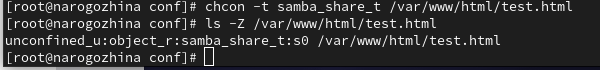{#fig:010 width=70%}

## Попытка подключения

Попробуйте ещё раз получить доступ к файлу через веб-сервер, введя в браузере адрес http://127.0.0.1/test.html. Вы должны получить сообщение об ошибке:
```
Forbidden
You don't have permission to access /test.html on this server.
```

## Попытка подключения

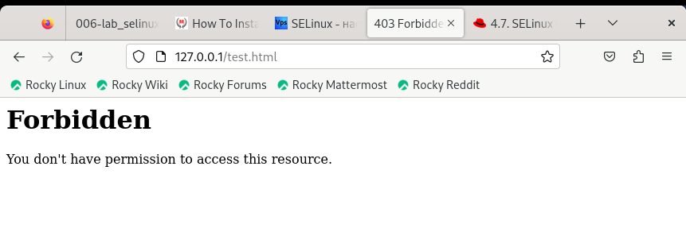{#fig:011 width=70%}

## Просмотр аттрибутов файла ls -l /var/www/html/test.html

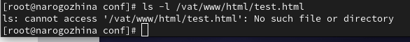{#fig:012 width=70%}

## Переписывание порта

Попробуйте запустить веб-сервер Apache на прослушивание ТСР-порта 81 (а не 80, как рекомендует IANA и прописано в /etc/services). Для этого в файле `/etc/httpd/httpd.conf` найдите строчку `Listen 80` и замените её на `Listen 81`.

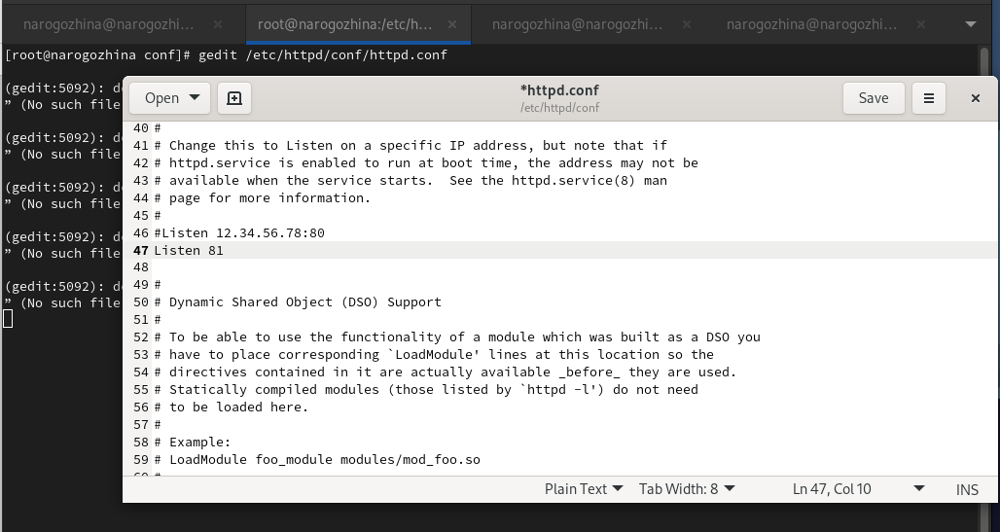{#fig:015 width=50%}

## Рестарт сервера

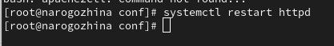{#fig:016 width=70%}

## Попытка подключения

При попытке переподключиться - произошел сбой, т.к. мы подключаемся по другому tcp серверу.

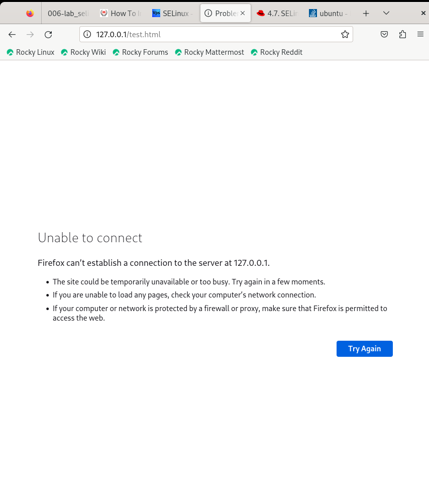{#fig:017 width=40%}

## Добавление нашего порта

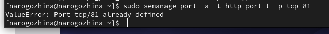{#fig:022 width=70%}

## Список доступных портов

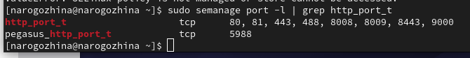{#fig:023 width=70%}

Порт 81 появился в списке.

## Попытка переподключения

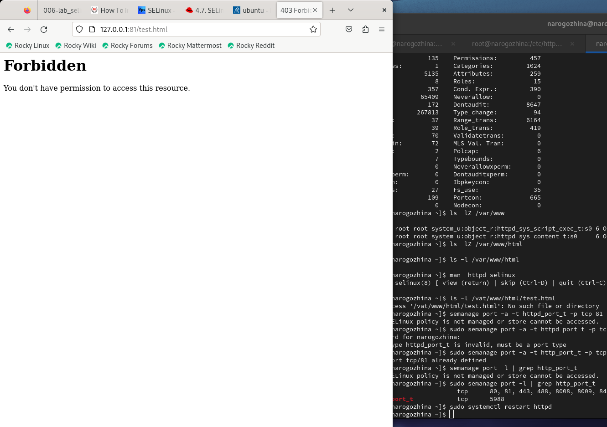{#fig:024 width=70%}

Сейчас мы подключаемся к серверу, который знаком нашей программе, и поэтому подключение у нас прошло. Да, доступа у нас нет, но тем не менее, сервер запустился, а не выдал ошибку.

# Выводы

В ходе лабораторной работы мы развили навыки администрирования ОС Linux, получить первое практическое знакомство с технологией SELinux1, а также проверили работу SELinx на практике совместно с веб-сервером Apache.
