---
## Front matter
title: "Отчёт по лабораторной работе №6"
subtitle: "Основы информационной безопасности"
author: "Надежда Александровна Рогожина"

## Generic otions
lang: ru-RU
toc-title: "Содержание"

## Bibliography
bibliography: bib/cite.bib
csl: pandoc/csl/gost-r-7-0-5-2008-numeric.csl

## Pdf output format
toc: true # Table of contents
toc-depth: 2
lof: true # List of figures
lot: true # List of tables
fontsize: 12pt
linestretch: 1.5
papersize: a4
documentclass: scrreprt
## I18n polyglossia
polyglossia-lang:
  name: russian
  options:
	- spelling=modern
	- babelshorthands=true
polyglossia-otherlangs:
  name: english
## I18n babel
babel-lang: russian
babel-otherlangs: english
## Fonts
mainfont: PT Serif
romanfont: PT Serif
sansfont: PT Sans
monofont: PT Mono
mainfontoptions: Ligatures=TeX
romanfontoptions: Ligatures=TeX
sansfontoptions: Ligatures=TeX,Scale=MatchLowercase
monofontoptions: Scale=MatchLowercase,Scale=0.9
## Biblatex
biblatex: true
biblio-style: "gost-numeric"
biblatexoptions:
  - parentracker=true
  - backend=biber
  - hyperref=auto
  - language=auto
  - autolang=other*
  - citestyle=gost-numeric
## Pandoc-crossref LaTeX customization
figureTitle: "Рис."
tableTitle: "Таблица"
listingTitle: "Листинг"
lofTitle: "Список иллюстраций"
lotTitle: "Список таблиц"
lolTitle: "Листинги"
## Misc options
indent: true
header-includes:
  - \usepackage{indentfirst}
  - \usepackage{float} # keep figures where there are in the text
  - \floatplacement{figure}{H} # keep figures where there are in the text
---

# Цель работы

- Развить навыки администрирования ОС Linux. Получить первое практическое знакомство с технологией SELinux1.
- Проверить работу SELinx на практике совместно с веб-сервером Apache.

# Теоретическое введение

SELinux (SELinux) — это система принудительного контроля доступа, реализованная на уровне ядра. Впервые эта система появилась в четвертой версии CentOS, а в 5 и 6 версии реализация была существенно дополнена и улучшена. Эти улучшения позволили SELinux стать универсальной системой, способной эффективно решать массу актуальных задач. Стоит помнить, что классическая система прав Unix применяется первой, и управление перейдет к SELinux только в том случае, если эта первичная проверка будет успешно пройдена.

Для того, чтобы понять, в чем состоит практическая ценность SELinux, рассмотрим несколько примеров, когда стандартная система контроля доступа недостаточна. Если SELinux отключен, то вам доступна только классическая дискреционная система контроля доступа, которая включает в себя DAC (избирательное управление доступом) или ACL(списки контроля доступа). То есть речь идет о манипулировании правами на запись, чтение и исполнение на уровне пользователей и групп пользователей, чего в некоторых случаях может быть совершенно недостаточно. Например:

- Администратор не может в полной мере контролировать действия пользователя. Например, пользователь вполне способен дать всем остальным пользователям права на чтение собственных конфиденциальных файлов, таких как ключи SSH.
- Процессы могут изменять настройки безопасности. Например, файлы, содержащие в себе почту пользователя должны быть доступны для чтения только одному конкретному пользователю, но почтовый клиент вполне может изменить права доступа так, что эти файлы будут доступны для чтения всем.
- Процессы наследуют права пользователя, который их запустил. Например, зараженная трояном версия браузера Firefox в состоянии читать SSH-ключи пользователя, хотя не имеет для того никаких оснований.

По сути, в традиционной модели избирательного управления доступом (DAC), хорошо реализованы только два уровня доступа — пользователь и суперпользователь. Нет простого метода, который позволил бы устанавливать для каждого пользователя необходимый минимум привилегий. В табл. [-@tbl:std-dir] приведено краткое описание основных терминов SELinux.

: Описание основных терминов SELinux {#tbl:std-dir}

| Термин | Описание                           |
|--------------|--------------------------------------------------|
| `Домен`          | Список действий, которые может выполнять процесс. Обычно в качестве домена определяется минимально-возможный набор действий, при помощи которых процесс способен функционировать. Таким образом, если процесс дискредитирован, злоумышленнику не удастся нанести большого вреда.     |
| `Роль`      | Список доменов, которые могут быть применены. Если какого-то домена нет в списке доменов какой-то роли, то действия из этого домена не могут быть применены. |
| `Тип`       | Набор действий, которые допустимы по отношения к объекту. Тип отличается от домена тем, что он может применяться к пайпам, каталогам и файлам, в то время как домен применяется к процессам.    |
| `Контекст безопасности`      | Все атрибуты SELinux — роли, типы и домены.  |

# Выполнение лабораторной работы

1. Войдите в систему с полученными учётными данными и убедитесь, что SELinux работает в режиме enforcing политики targeted с помощью команд getenforce и sestatus (рис. [-@fig:001]).

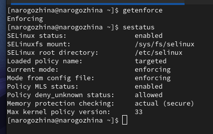{#fig:001 width=70%}

2. Обратитесь с помощью браузера к веб-серверу, запущенному на вашем компьютере, и убедитесь, что последний работает `service httpd status` (рис. [-@fig:002]).

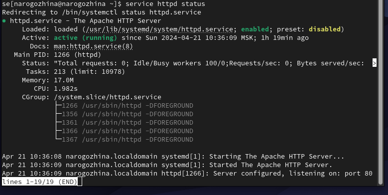{#fig:002 width=70%}

3. Найдите веб-сервер Apache в списке процессов, определите его контекст безопасности и занесите эту информацию в отчёт. Например, можно использовать команду `ps auxZ | grep httpd` или `ps -eZ | grep httpd` (рис. [-@fig:003]).

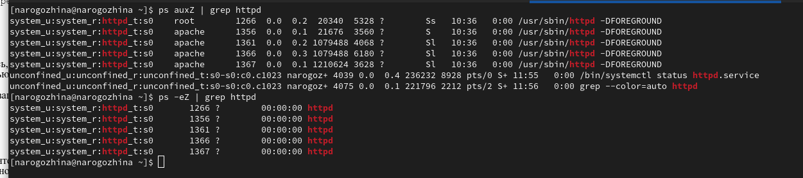{#fig:003 width=70%}

4. Посмотрите текущее состояние переключателей SELinux для Apache (рис. [-@fig:004]).

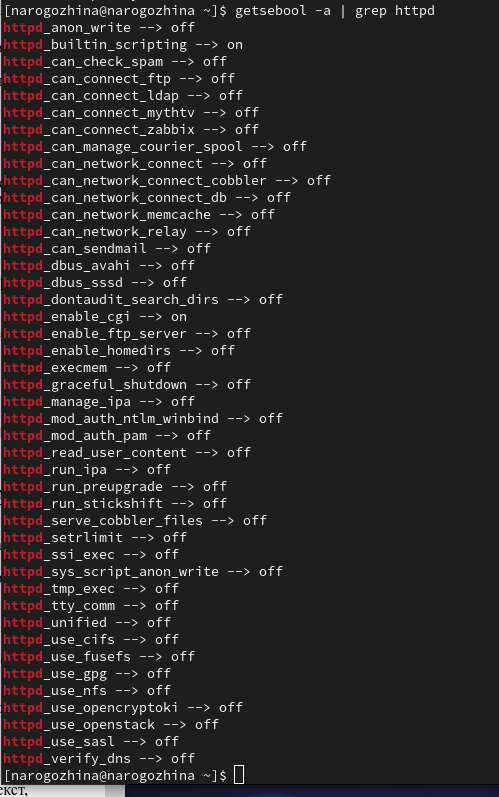{#fig:004 width=70%}

5. Посмотрите статистику по политике с помощью команды seinfo, также определите множество пользователей, ролей, типов (рис. [-@fig:005]).

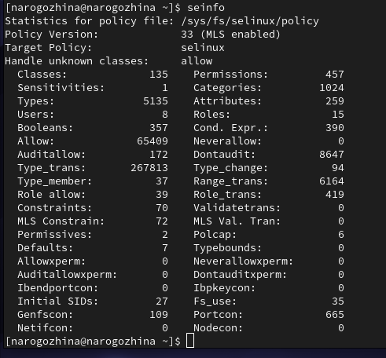{#fig:005 width=70%}

6. Определите тип файлов и поддиректорий, находящихся в директории /var/www, с помощью команды `ls -lZ /var/www` (рис. [-@fig:006]).

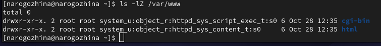{#fig:006 width=70%}

7. Определите тип файлов, находящихся в директории /var/www/html `ls -lZ /var/www/html` (рис. [-@fig:007]).

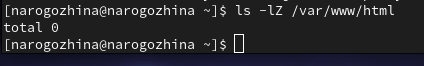{#fig:007 width=70%}

8. Создание файлов в директории /var/www/html разрешено только владельцу данной директории.

9. Создайте от имени суперпользователя (так как в дистрибутиве после установки только ему разрешена запись в директорию) html-файл `/var/www/html/test.html` следующего содержания:
```
<html>
<body>test</body>
</html>
```
(рис. [-@fig:008]).

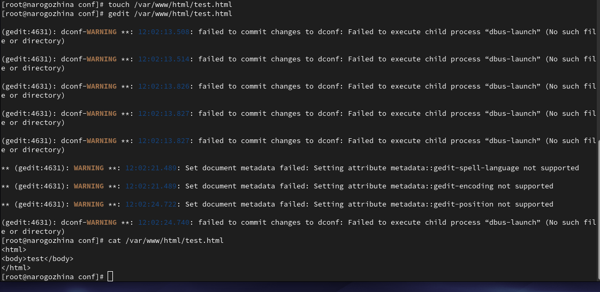{#fig:008 width=70%}

10. Обратитесь к файлу через веб-сервер, введя в браузере адрес http://127.0.0.1/test.html. Убедитесь, что файл был успешно отображён (рис. [-@fig:009]).

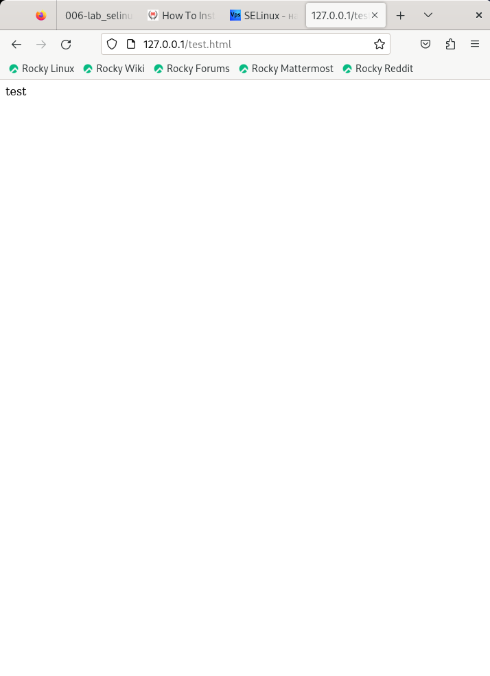{#fig:009 width=70%}

11. Тип файла `test.html`: `unconfined_u:object_r:httpd_sys_content_t:s0`

12. Измените контекст файла `/var/www/html/test.html` с `httpd_sys_content_t` на любой другой, к которому процесс httpd не должен иметь доступа, например, на `samba_share_t`: 
```
chcon -t samba_share_t /var/www/html/test.html
ls -Z /var/www/html/test.html
```
(рис. [-@fig:010]).

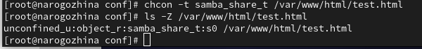{#fig:010 width=70%}

13. Попробуйте ещё раз получить доступ к файлу через веб-сервер, введя в браузере адрес http://127.0.0.1/test.html. Вы должны получить сообщение об ошибке:
```
Forbidden
You don't have permission to access /test.html on this server.
```
(рис. [-@fig:011]).

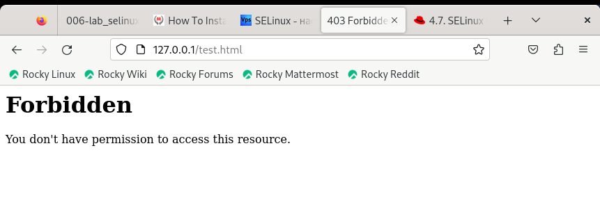{#fig:011 width=70%}

15. `ls -l /var/www/html/test.html` (рис. [-@fig:012]).

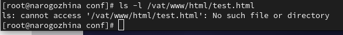{#fig:012 width=70%}

Просмотрите log-файлы веб-сервера Apache. Также просмотрите системный лог-файл (рис. [-@fig:013]).

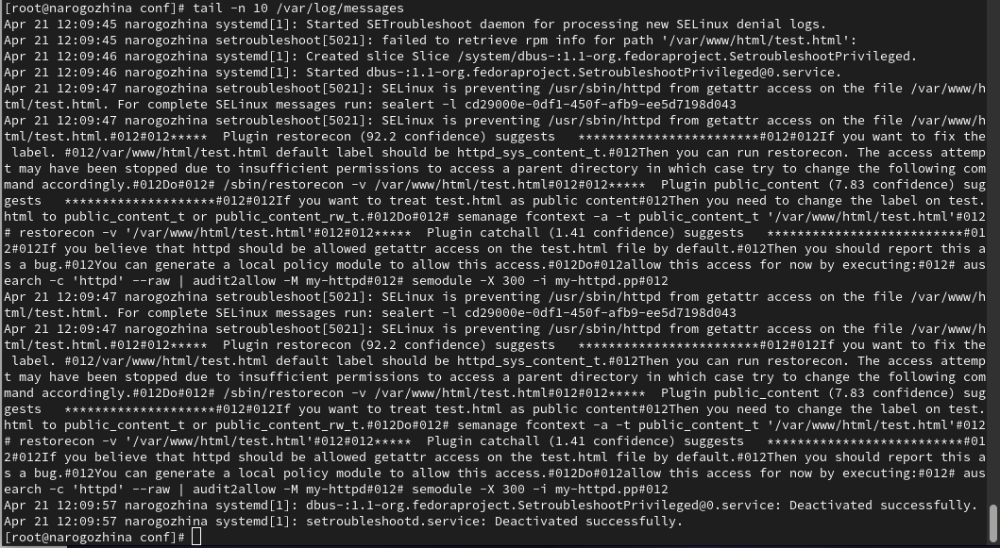{#fig:013 width=70%}

Если в системе окажутся запущенными процессы setroubleshootd и audtd, то вы также сможете увидеть ошибки, аналогичные указанным выше, в файле /var/log/audit/audit.log. Проверьте это утверждение самостоятельно (рис. [-@fig:014]).

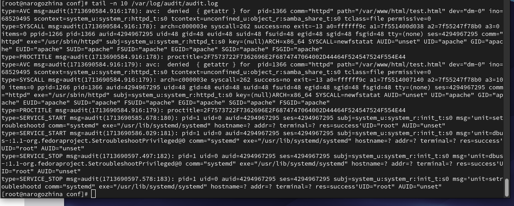{#fig:014 width=70%}

16. Попробуйте запустить веб-сервер Apache на прослушивание ТСР-порта 81 (а не 80, как рекомендует IANA и прописано в /etc/services). Для этого в файле `/etc/httpd/httpd.conf` найдите строчку `Listen 80` и замените её на `Listen 81` (рис. [-@fig:015]).

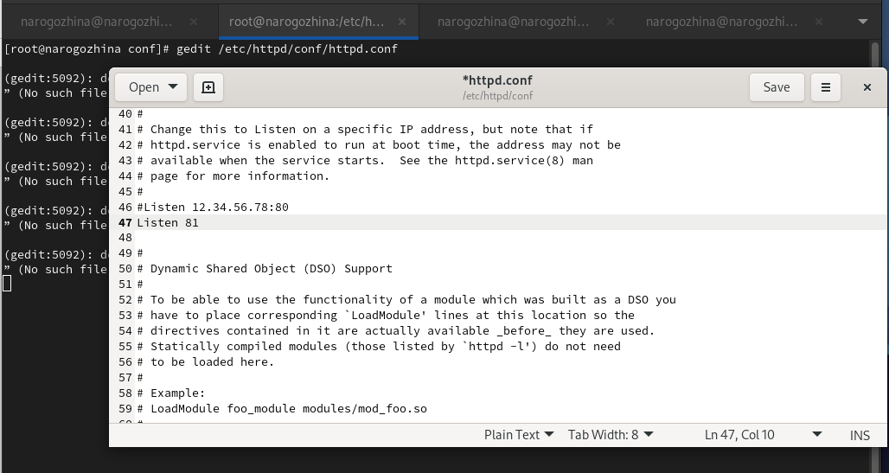{#fig:015 width=70%}

17. Выполните перезапуск веб-сервера Apache (рис. [-@fig:016]).

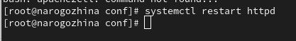{#fig:016 width=70%}

При попытке переподключиться - произошел сбой, т.к. мы подключаемся по другому tcp серверу (рис. [-@fig:017]).

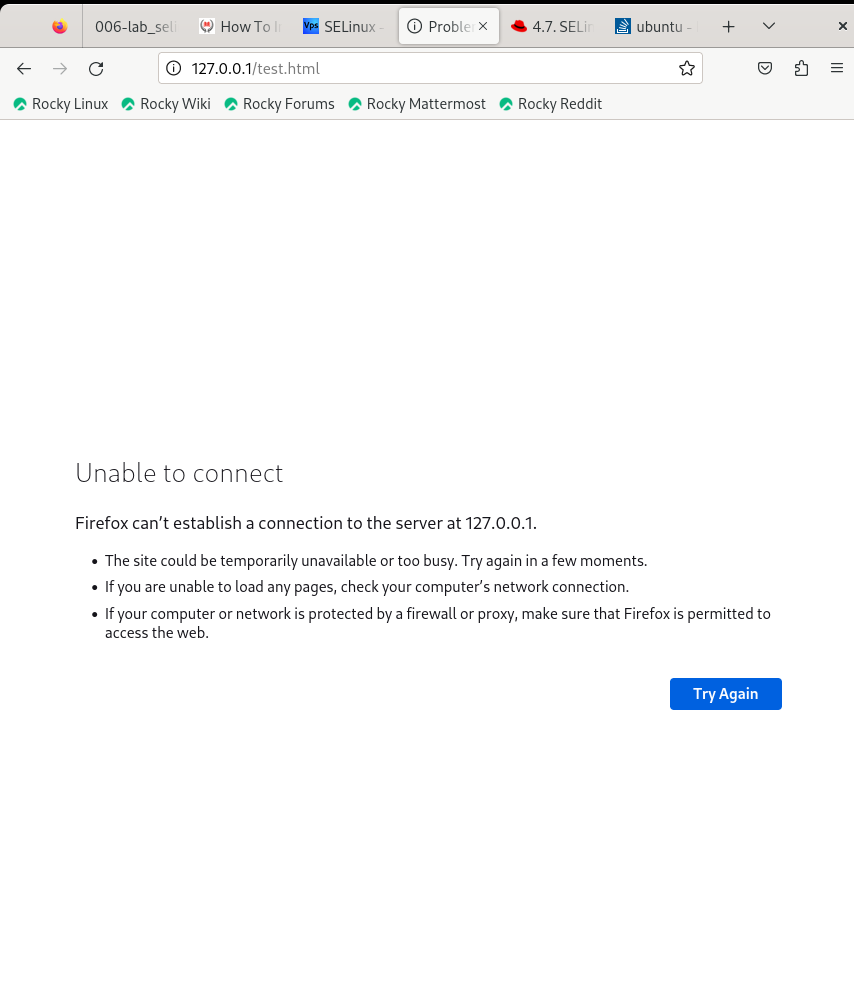{#fig:017 width=70%}

18. Проанализируйте лог-файлы: `tail -nl /var/log/messages`(рис. [-@fig:018]).

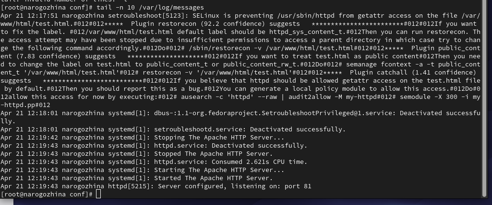{#fig:018 width=70%}

Просмотрите файлы `/var/log/http/error_log`, `/var/log/http/access_log` и `/var/log/audit/audit.log` и выясните, в каких файлах появились записи (рис. [-@fig:019], рис. [-@fig:020], рис. [-@fig:021]).

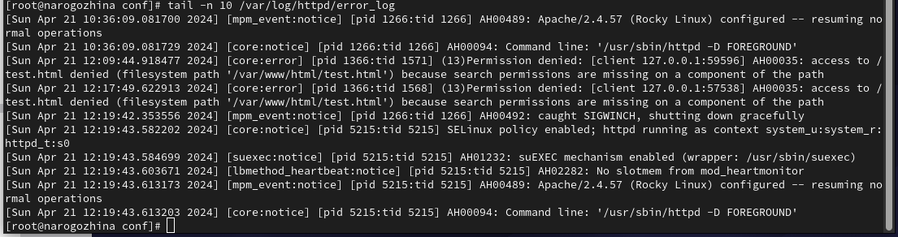{#fig:019 width=70%}

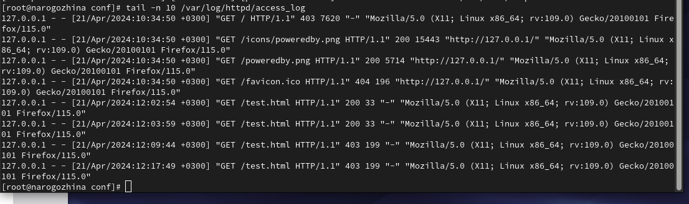{#fig:020 width=70%}

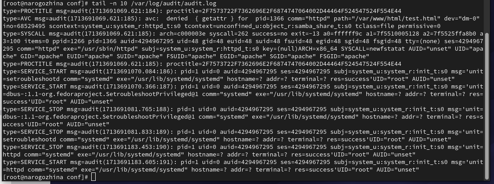{#fig:021 width=70%}

19. Выполните команду `semanage port -a -t http_port_t -р tcp 81` (рис. [-@fig:022]).

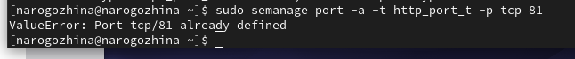{#fig:022 width=70%}

После этого проверьте список портов командой `semanage port -l | grep http_port_t` (рис. [-@fig:023]).

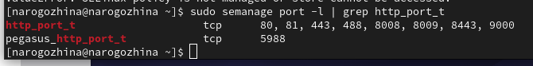{#fig:023 width=70%}

Порт 81 появился в списке.

20. Попробуйте запустить веб-сервер Apache ещё раз (рис. [-@fig:024]).

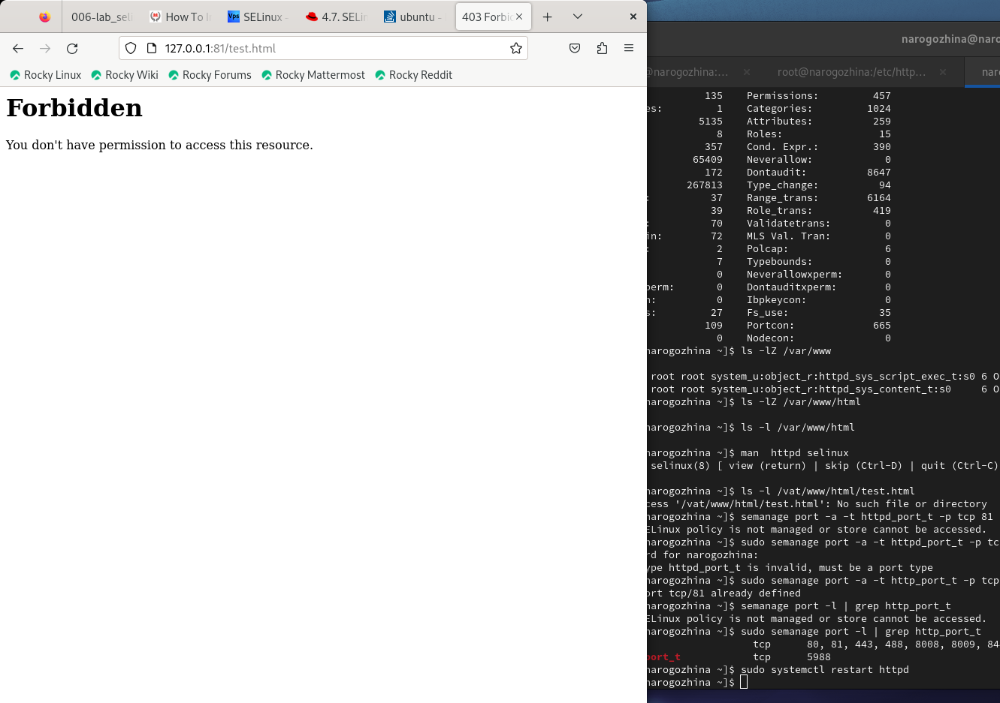{#fig:024 width=70%}

Сейчас мы подключаемся к серверу, который знаком нашей программе, и поэтому подключение у нас прошло. Да, доступа у нас нет, но тем не менее, сервер запустился, а не выдал ошибку.

21. Верните контекст `httpd_sys_cоntent__t` к файлу `/var/www/html/ test.html`: 
```
chcon -t httpd_sys_content_t /var/www/html/test.html
```
После этого попробуйте получить доступ к файлу через веб-сервер, введя в браузере адрес http://127.0.0.1:81/test.html. Вы должны увидеть содержимое файла — слово «test».
(рис. [-@fig:025]).

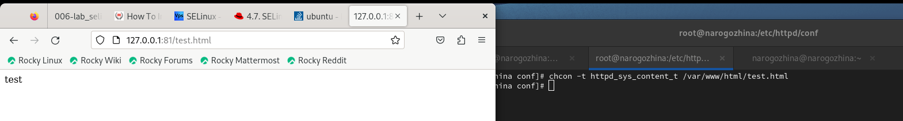{#fig:025 width=70%}

22. Исправьте обратно конфигурационный файл apache, вернув `Listen 80` (рис. [-@fig:026]).

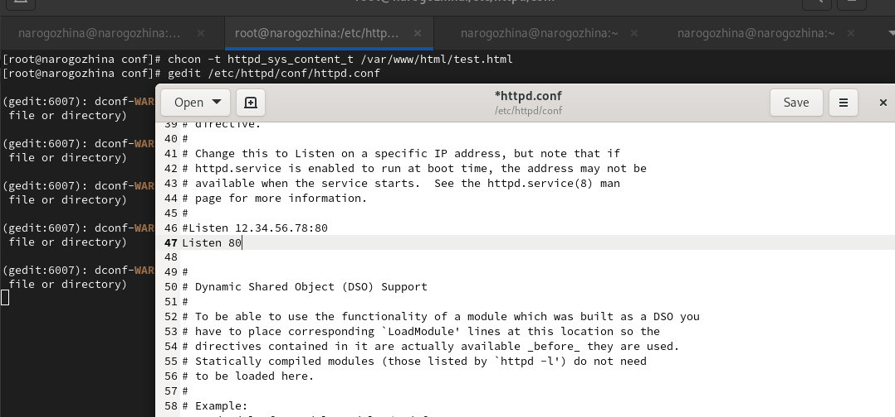{#fig:026 width=70%}

23. Удалите привязку `http_port_t` к 81 порту: `semanage port -d -t http_port_t -p tcp 81` и проверьте, что порт 81 удалён.
24. Удалите файл `/var/www/html/test.html`:
```
rm /var/www/html/test.html
```
(рис. [-@fig:027]).

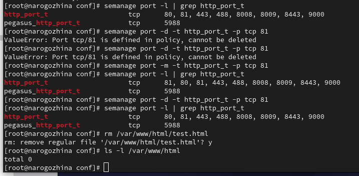{#fig:027 width=70%}

# Выводы

В ходе лабораторной работы мы развили навыки администрирования ОС Linux, получить первое практическое знакомство с технологией SELinux1, а также проверили работу SELinx на практике совместно с веб-сервером Apache.

# Список литературы{.unnumbered}

::: {#refs}
:::
