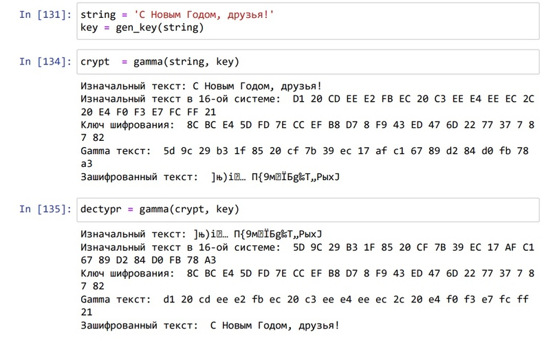

---
## Front matter
lang: ru-RU
title: Презентация по лабораторной работе №7.
subtitle: Основы информационной безопасности.
author:
  - Рогожина Н.А.
institute:
  - Российский университет дружбы народов, Москва, Россия

date: 9 мая 2024

## i18n babel
babel-lang: russian
babel-otherlangs: english

## Formatting pdf
toc: false
toc-title: Содержание
slide_level: 2
aspectratio: 169
section-titles: true
theme: metropolis
header-includes:
 - \metroset{progressbar=frametitle,sectionpage=progressbar,numbering=fraction}
 - '\makeatletter'
 - '\beamer@ignorenonframefalse'
 - '\makeatother'
---

# Информация

## Докладчик

:::::::::::::: {.columns align=center}
::: {.column width="70%"}

  * Рогожина Надежда Александровна
  * Студентка 2го курса, НКАбд-02-22
  * Компьютерные и информационные науки
  * Российский университет дружбы народов
  * [Github](https://github.com/MikoGreen/study_2023-2024_infosec)

:::
::: {.column width="30%"}

:::
::::::::::::::

# Вводная часть

## Цель работы

Освоить на практике применение режима однократного гаммирования.

## Задание

Нужно подобрать ключ, чтобы получить сообщение «С Новым Годом, друзья!». Требуется разработать приложение, позволяющее шифровать и дешифровать данные в режиме однократного гаммирования. Приложение должно:

1. Определить вид шифротекста при известном ключе и известном открытом тексте.
2. Определить ключ, с помощью которого шифротекст может быть преобразован в некоторый фрагмент текста, представляющий собой один из возможных вариантов прочтения открытого текста.

## Теоретическое введение

*Гаммирование* представляет собой наложение (снятие) на открытые (зашифрованные) данные последовательности элементов других данных, полученной с помощью некоторого криптографического алгоритма, для получения зашифрованных (открытых) данных. Иными словами, наложение гаммы — это сложение её элементов с элементами открытого (закрытого) текста по некоторому фиксированному модулю, значение которого представляет собой известную часть алгоритма шифрования.

## Теоретическое введение

В соответствии с теорией криптоанализа, если в методе шифрования используется однократная вероятностная гамма (однократное гаммирование) той же длины, что и подлежащий сокрытию текст, то текст нельзя раскрыть. Даже при раскрытии части последовательности гаммы нельзя получить информацию о всём скрываемом тексте. Наложение гаммы по сути представляет собой выполнение операции сложения по модулю 2 (XOR) (обозначаемая знаком ⊕) между элементами гаммы и элементами подлежащего сокрытию текста.

Такой метод шифрования является симметричным, так как двойное прибавление одной и той же величины по модулю 2 восстанавливает исходное значение, а шифрование и расшифрование выполняется одной и той же программой.

# Выполнение

## Код программы

```
def gen_key(string):
    k = np.random.randint(0, 255, len(string))
    key = [hex(i)[2:] for i in k]
    return key
```

## Код программы

```
def gamma(string, key):
    print(f'Изначальный текст: {string}')
    hex_str = []
    for i in string:
        hex_str.append(i.encode('cp1251').hex().upper())
    print(f'Изначальный текст в 16-ой системе: ',*hex_str)
```

## Код программы

```
hex_key = []
    for i in key:
        hex_key.append(i.upper())
    print(f'Ключ шифрования: ', *hex_key)
```

## Код программы

```
    gamma = []
    for i in range(len(hex_str)):
        gamma.append('{:02x}'.format(int(hex_str[i], 16)^int(hex_key[i], 16)))
    print(f'Gamma текст: ', *gamma)
    cr_str = bytearray.fromhex(''.join(gamma)).decode('cp1251')
    print(f'Зашифрованный текст: ', cr_str)
    return cr_str
```

## Результат работы программы

{#fig:001 width=70%}

# Выводы

## Выводы

В ходе лабораторной работы мы написали код для шифрации и дешифрации фразы "С Новым Годом, друзья!", а также освоили основные принципы однократного гаммирования.

# Спасибо за внимание
