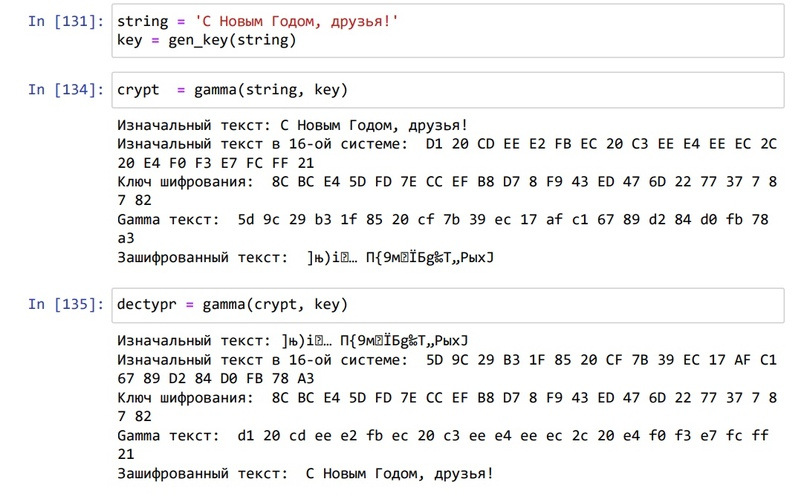

---
## Front matter
title: "Отчёт по лабораторной работе №7"
subtitle: "Основы информационной безопасности"
author: "Надежда Александровна Рогожина"

## Generic otions
lang: ru-RU
toc-title: "Содержание"

## Bibliography
bibliography: bib/cite.bib
csl: pandoc/csl/gost-r-7-0-5-2008-numeric.csl

## Pdf output format
toc: true # Table of contents
toc-depth: 2
lof: true # List of figures
lot: true # List of tables
fontsize: 12pt
linestretch: 1.5
papersize: a4
documentclass: scrreprt
## I18n polyglossia
polyglossia-lang:
  name: russian
  options:
	- spelling=modern
	- babelshorthands=true
polyglossia-otherlangs:
  name: english
## I18n babel
babel-lang: russian
babel-otherlangs: english
## Fonts
mainfont: PT Serif
romanfont: PT Serif
sansfont: PT Sans
monofont: PT Mono
mainfontoptions: Ligatures=TeX
romanfontoptions: Ligatures=TeX
sansfontoptions: Ligatures=TeX,Scale=MatchLowercase
monofontoptions: Scale=MatchLowercase,Scale=0.9
## Biblatex
biblatex: true
biblio-style: "gost-numeric"
biblatexoptions:
  - parentracker=true
  - backend=biber
  - hyperref=auto
  - language=auto
  - autolang=other*
  - citestyle=gost-numeric
## Pandoc-crossref LaTeX customization
figureTitle: "Рис."
tableTitle: "Таблица"
listingTitle: "Листинг"
lofTitle: "Список иллюстраций"
lotTitle: "Список таблиц"
lolTitle: "Листинги"
## Misc options
indent: true
header-includes:
  - \usepackage{indentfirst}
  - \usepackage{float} # keep figures where there are in the text
  - \floatplacement{figure}{H} # keep figures where there are in the text
---

# Цель работы

Освоить на практике применение режима однократного гаммирования.

# Задание

Нужно подобрать ключ, чтобы получить сообщение «С Новым Годом, друзья!». Требуется разработать приложение, позволяющее шифровать и дешифровать данные в режиме однократного гаммирования. Приложение должно:

1. Определить вид шифротекста при известном ключе и известном открытом тексте.
2. Определить ключ, с помощью которого шифротекст может быть преобразован в некоторый фрагмент текста, представляющий собой один из возможных вариантов прочтения открытого текста.

# Теоретическое введение

*Гаммирование* представляет собой наложение (снятие) на открытые (зашифрованные) данные последовательности элементов других данных, полученной с помощью некоторого криптографического алгоритма, для получения зашифрованных (открытых) данных. Иными словами, наложение гаммы — это сложение её элементов с элементами открытого (закрытого) текста по некоторому фиксированному модулю, значение которого представляет собой известную часть алгоритма шифрования.

В соответствии с теорией криптоанализа, если в методе шифрования используется однократная вероятностная гамма (однократное гаммирование) той же длины, что и подлежащий сокрытию текст, то текст нельзя раскрыть. Даже при раскрытии части последовательности гаммы нельзя получить информацию о всём скрываемом тексте. Наложение гаммы по сути представляет собой выполнение операции сложения по модулю 2 (XOR) (обозначаемая знаком ⊕) между элементами гаммы и элементами подлежащего сокрытию текста.

Такой метод шифрования является симметричным, так как двойное прибавление одной и той же величины по модулю 2 восстанавливает исходное значение, а шифрование и расшифрование выполняется одной и той же программой.


# Выполнение лабораторной работы

Код программы:
```
def gen_key(string):
    k = np.random.randint(0, 255, len(string))
    key = [hex(i)[2:] for i in k]
    return key
    
def gamma(string, key):
    print(f'Изначальный текст: {string}')
    hex_str = []
    for i in string:
        hex_str.append(i.encode('cp1251').hex().upper())
    print(f'Изначальный текст в 16-ой системе: ',*hex_str)

    hex_key = []
    for i in key:
        hex_key.append(i.upper())
    print(f'Ключ шифрования: ', *hex_key)
    
    gamma = []
    for i in range(len(hex_str)):
        gamma.append('{:02x}'.format(int(hex_str[i], 16)^int(hex_key[i], 16)))
    print(f'Gamma текст: ', *gamma)
    cr_str = bytearray.fromhex(''.join(gamma)).decode('cp1251')
    print(f'Зашифрованный текст: ', cr_str)
    return cr_str
```

Пример работы (рис. [-@fig:001]).

{#fig:001 width=70%}

# Выводы

В ходе лабораторной работы мы написали код для шифрации и дешифрации фразы "С Новым Годом, друзья!", а также освоили основные принципы однократного гаммирования.

# Список литературы{.unnumbered}

::: {#refs}
:::
