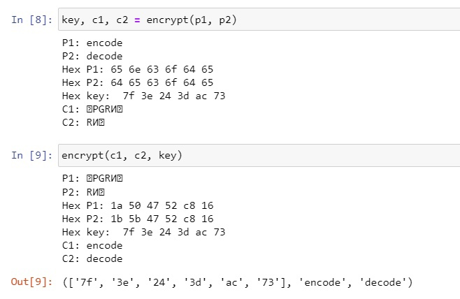
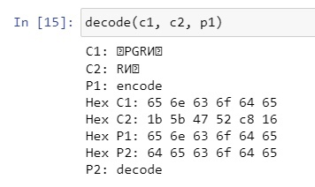

---
### Front matter
lang: ru-RU
title: Презентация по лабораторной работе №8.
subtitle: Основы информационной безопасности.
author:
  - Рогожина Н.А.
institute:
  - Российский университет дружбы народов, Москва, Россия

date: 9 мая 2024

## i18n babel
babel-lang: russian
babel-otherlangs: english

## Formatting pdf
toc: false
toc-title: Содержание
slide_level: 2
aspectratio: 169
section-titles: true
theme: metropolis
header-includes:
 - \metroset{progressbar=frametitle,sectionpage=progressbar,numbering=fraction}
 - '\makeatletter'
 - '\beamer@ignorenonframefalse'
 - '\makeatother'
---

# Информация

## Докладчик

:::::::::::::: {.columns align=center}
::: {.column width="70%"}

  * Рогожина Надежда Александровна
  * Студентка 2го курса, НКАбд-02-22
  * Компьютерные и информационные науки
  * Российский университет дружбы народов
  * [Github](https://github.com/MikoGreen/study_2023-2024_infosec)

:::
::: {.column width="30%"}

:::
::::::::::::::

# Вводная часть

## Цель работы

Освоить на практике применение режима однократного гаммирования на примере кодирования различных исходных текстов одним ключом.

## Задание

Два текста кодируются одним ключом (однократное гаммирование). Требуется не зная ключа и не стремясь его определить, прочитать оба текста. Необходимо разработать приложение, позволяющее шифровать и дешифровать тексты P1 и P2 в режиме однократного гаммирования. Приложение должно определить вид шифротекстов C1 и C2 обоих текстов P1 и P2 при известном ключе ; Необходимо определить и выразить аналитически способ, при котором злоумышленник может прочитать оба текста, не зная ключа и не стремясь его определить.


## Теоретическое введение

*Гаммирование* представляет собой наложение (снятие) на открытые (зашифрованные) данные последовательности элементов других данных, полученной с помощью некоторого криптографического алгоритма, для получения зашифрованных (открытых) данных. Иными словами, наложение гаммы — это сложение её элементов с элементами открытого (закрытого) текста по некоторому фиксированному модулю, значение которого представляет собой известную часть алгоритма шифрования.

## Теоретическое введение

В соответствии с теорией криптоанализа, если в методе шифрования используется однократная вероятностная гамма (однократное гаммирование) той же длины, что и подлежащий сокрытию текст, то текст нельзя раскрыть. Даже при раскрытии части последовательности гаммы нельзя получить информацию о всём скрываемом тексте. Наложение гаммы по сути представляет собой выполнение операции сложения по модулю 2 (XOR) (обозначаемая знаком ⊕) между элементами гаммы и элементами подлежащего сокрытию текста.

Такой метод шифрования является симметричным, так как двойное прибавление одной и той же величины по модулю 2 восстанавливает исходное значение, а шифрование и расшифрование выполняется одной и той же программой.

# Выполнение

## Код программы

```
def encrypt(p1, p2, key=0):
    print(f'P1: {p1}')
    print(f'P2: {p2}')
    
    hex_p1 = []
    hex_p2 = []
```

## Код программы

```
    for i in range(len(p1)):
        hex_p1.append(p1[i].encode('cp1251').hex())
        hex_p2.append(p2[i].encode('cp1251').hex())
        
    print(f'Hex P1: {" ".join(hex_p1)}')
    print(f'Hex P2: {" ".join(hex_p2)}')
```

## Код программы

```
    if key == 0:
        k = np.random.randint(0, 255, len(p1))
        key = [hex(i)[2:] for i in k]
    print(f'Hex key: ', *key)
    
    hex_c1 = []
    hex_c2 = []

    for i in range(len(hex_p1)):
        hex_c1.append('{:02x}'.format(int(key[i], 16)^int(hex_p1[i], 16)))
        hex_c2.append('{:02x}'.format(int(key[i], 16)^int(hex_p2[i], 16)))
```

## Код программы

```
    c1 = bytearray.fromhex(''.join(hex_c1)).decode('cp1251')
    c2 = bytearray.fromhex(''.join(hex_c2)).decode('cp1251')
    
    print(f'C1: {c1}')
    print(f'C2: {c2}')
    return key, c1, c2
```

## Код программы

```
def decode(c1, c2, p1):
    print(f'С1: {c1}')
    print(f'С2: {c2}')
    print(f'P1: {p1}')

    hex_c1 = []
    hex_c2 = []
    hex_p1 = []
```

## Код программы

```
    for i in range(len(p1)):
        hex_c1.append(c1[i].encode('cp1251').hex())
        hex_c2.append(c2[i].encode('cp1251').hex())
        hex_p1.append(p1[i].encode('cp1251').hex())
    
    print(f'Hex C1: {" ".join(hex_p1)}')
    print(f'Hex C2: {" ".join(hex_c2)}')
    print(f'Hex P1: {" ".join(hex_p1)}')
```

## Код программы

```
    hex_p2 = []

    for i in range(len(hex_p1)):
        hex_p2.append('{:02x}'.format(int(hex_c1[i], 16)^int(hex_c2[i], 16)
    
    print(f'Hex P2: {" ".join(hex_p2)}')
    
    p2 = bytearray.fromhex(''.join(hex_p2)).decode('cp1251')
    
    print(f'P2: {p2}')
```

## Пример работы `encode`

{#fig:001 width=70%}

## Пример работы `decode`

{#fig:002 width=70%}

# Выводы

## Выводы

В ходе работы у нас получилось освоить на практике применение режима однократного гаммирования на примере кодирования различных исходных текстов одним ключом.

# Спасибо за внимание!


