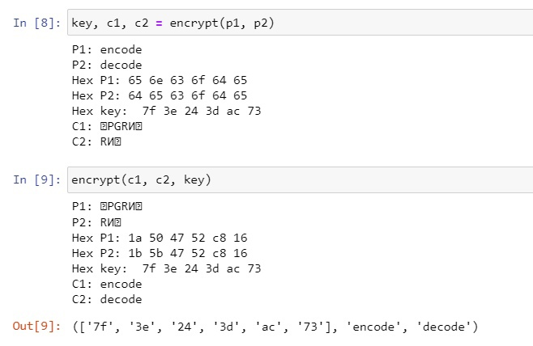
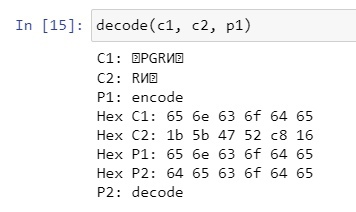

---
## Front matter
title: "Отчёт по лабораторной работе №8"
subtitle: "Основы информационной безопасности"
author: "Надежда Александровна Рогожина"

## Generic otions
lang: ru-RU
toc-title: "Содержание"

## Bibliography
bibliography: bib/cite.bib
csl: pandoc/csl/gost-r-7-0-5-2008-numeric.csl

## Pdf output format
toc: true # Table of contents
toc-depth: 2
lof: true # List of figures
lot: true # List of tables
fontsize: 12pt
linestretch: 1.5
papersize: a4
documentclass: scrreprt
## I18n polyglossia
polyglossia-lang:
  name: russian
  options:
	- spelling=modern
	- babelshorthands=true
polyglossia-otherlangs:
  name: english
## I18n babel
babel-lang: russian
babel-otherlangs: english
## Fonts
mainfont: PT Serif
romanfont: PT Serif
sansfont: PT Sans
monofont: PT Mono
mainfontoptions: Ligatures=TeX
romanfontoptions: Ligatures=TeX
sansfontoptions: Ligatures=TeX,Scale=MatchLowercase
monofontoptions: Scale=MatchLowercase,Scale=0.9
## Biblatex
biblatex: true
biblio-style: "gost-numeric"
biblatexoptions:
  - parentracker=true
  - backend=biber
  - hyperref=auto
  - language=auto
  - autolang=other*
  - citestyle=gost-numeric
## Pandoc-crossref LaTeX customization
figureTitle: "Рис."
tableTitle: "Таблица"
listingTitle: "Листинг"
lofTitle: "Список иллюстраций"
lotTitle: "Список таблиц"
lolTitle: "Листинги"
## Misc options
indent: true
header-includes:
  - \usepackage{indentfirst}
  - \usepackage{float} # keep figures where there are in the text
  - \floatplacement{figure}{H} # keep figures where there are in the text
---

# Цель работы

Освоить на практике применение режима однократного гаммирования на примере кодирования различных исходных текстов одним ключом.

# Задание

Два текста кодируются одним ключом (однократное гаммирование). Требуется не зная ключа и не стремясь его определить, прочитать оба текста. Необходимо разработать приложение, позволяющее шифровать и дешифровать тексты P1 и P2 в режиме однократного гаммирования. Приложение должно определить вид шифротекстов C1 и C2 обоих текстов P1 и P2 при известном ключе ; Необходимо определить и выразить аналитически способ, при котором злоумышленник может прочитать оба текста, не зная ключа и не стремясь его определить.

# Теоретическое введение

*Гаммирование* представляет собой наложение (снятие) на открытые (зашифрованные) данные последовательности элементов других данных, полученной с помощью некоторого криптографического алгоритма, для получения зашифрованных (открытых) данных. Иными словами, наложение гаммы — это сложение её элементов с элементами открытого (закрытого) текста по некоторому фиксированному модулю, значение которого представляет собой известную часть алгоритма шифрования.

В соответствии с теорией криптоанализа, если в методе шифрования используется однократная вероятностная гамма (однократное гаммирование) той же длины, что и подлежащий сокрытию текст, то текст нельзя раскрыть. Даже при раскрытии части последовательности гаммы нельзя получить информацию о всём скрываемом тексте. Наложение гаммы по сути представляет собой выполнение операции сложения по модулю 2 (XOR) (обозначаемая знаком ⊕) между элементами гаммы и элементами подлежащего сокрытию текста.

Такой метод шифрования является симметричным, так как двойное прибавление одной и той же величины по модулю 2 восстанавливает исходное значение, а шифрование и расшифрование выполняется одной и той же программой.

# Выполнение лабораторной работы

Код программы:
```
def encrypt(p1, p2, key=0):
    print(f'P1: {p1}')
    print(f'P2: {p2}')
    
    hex_p1 = []
    hex_p2 = []
    
    for i in range(len(p1)):
        hex_p1.append(p1[i].encode('cp1251').hex())
        hex_p2.append(p2[i].encode('cp1251').hex())
        
    print(f'Hex P1: {" ".join(hex_p1)}')
    print(f'Hex P2: {" ".join(hex_p2)}')
    if key == 0:
        k = np.random.randint(0, 255, len(p1))
        key = [hex(i)[2:] for i in k]
    print(f'Hex key: ', *key)
    
    hex_c1 = []
    hex_c2 = []

    for i in range(len(hex_p1)):
        hex_c1.append('{:02x}'.format(int(key[i], 16)^int(hex_p1[i], 16)))
        hex_c2.append('{:02x}'.format(int(key[i], 16)^int(hex_p2[i], 16)))

    c1 = bytearray.fromhex(''.join(hex_c1)).decode('cp1251')
    c2 = bytearray.fromhex(''.join(hex_c2)).decode('cp1251')
    
    print(f'C1: {c1}')
    print(f'C2: {c2}')
    return key, c1, c2
    
def decode(c1, c2, p1):
    print(f'С1: {c1}')
    print(f'С2: {c2}')
    print(f'P1: {p1}')

    hex_c1 = []
    hex_c2 = []
    hex_p1 = []

    for i in range(len(p1)):
        hex_c1.append(c1[i].encode('cp1251').hex())
        hex_c2.append(c2[i].encode('cp1251').hex())
        hex_p1.append(p1[i].encode('cp1251').hex())
    
    print(f'Hex C1: {" ".join(hex_p1)}')
    print(f'Hex C2: {" ".join(hex_c2)}')
    print(f'Hex P1: {" ".join(hex_p1)}')
    
    hex_p2 = []

    for i in range(len(hex_p1)):
        hex_p2.append('{:02x}'.format(int(hex_c1[i], 16)^int(hex_c2[i], 16)
    
    print(f'Hex P2: {" ".join(hex_p2)}')
    
    p2 = bytearray.fromhex(''.join(hex_p2)).decode('cp1251')
    
    print(f'P2: {p2}')
```

Пример работы функции `encode` (рис. [-@fig:001]).

{#fig:001 width=70%}

Пример работы функции `decode` (рис. [-@fig:002]).

{#fig:002 width=70%}

# Выводы

В ходе работы у нас получилось освоить на практике применение режима однократного гаммирования на примере кодирования различных исходных текстов одним ключом.

# Список литературы{.unnumbered}

::: {#refs}
:::
