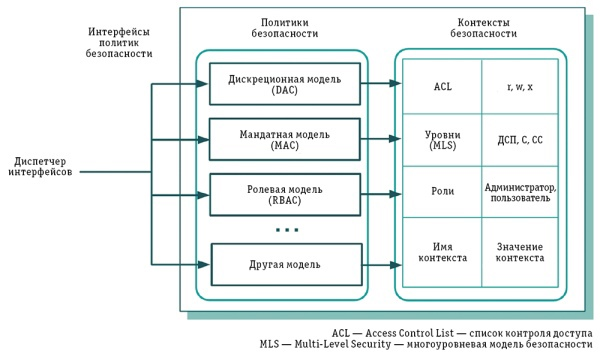
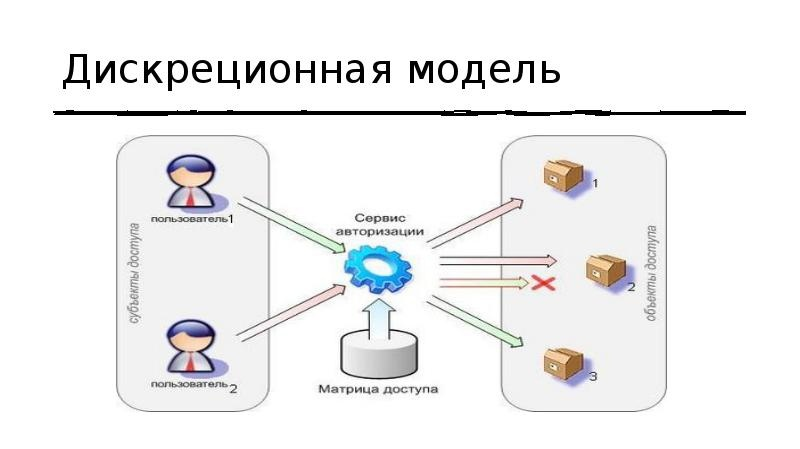
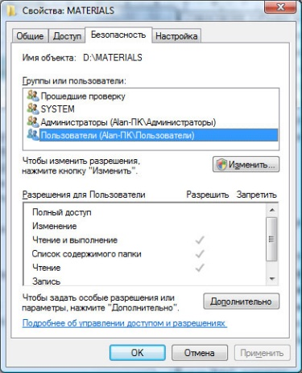
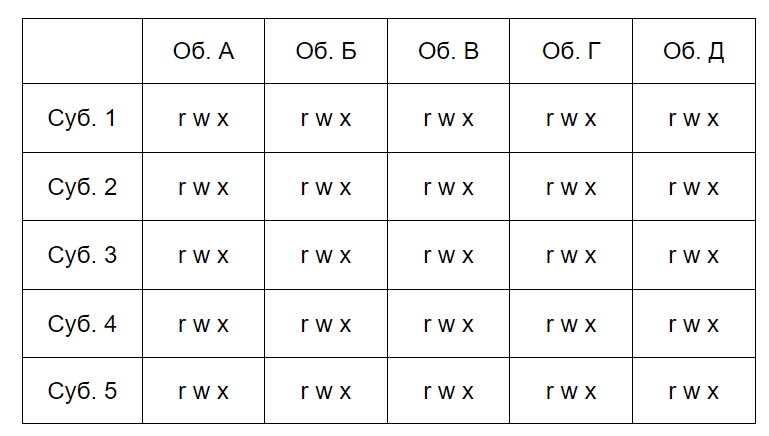
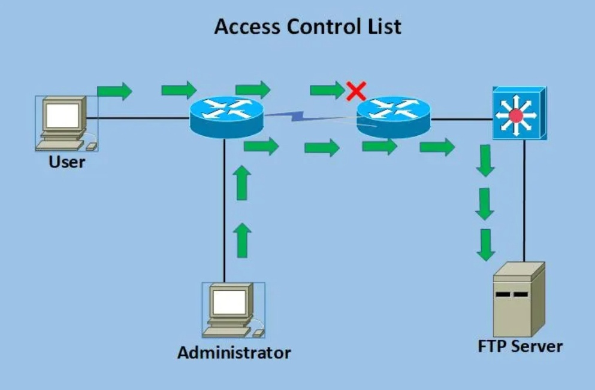
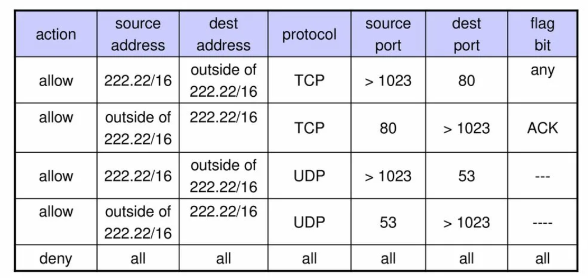

---
## Front matter
lang: ru-RU
title: Дискреционные модели доступа. Списки управления доступом.
subtitle: Доклад
author:
  - Рогожина Н.А.
institute:
  - Российский университет дружбы народов, Москва, Россия
date: 19 апреля 2024

## i18n babel
babel-lang: russian
babel-otherlangs: english

## Formatting pdf
toc: false
toc-title: Содержание
slide_level: 2
aspectratio: 169
section-titles: true
theme: metropolis
header-includes:
 - \metroset{progressbar=frametitle,sectionpage=progressbar,numbering=fraction}
 - '\makeatletter'
 - '\beamer@ignorenonframefalse'
 - '\makeatother'
---

# Информация

## Докладчик

:::::::::::::: {.columns align=center}
::: {.column width="70%"}

  * Рогожина Надежда Александровна
  * Студентка 2го курса, НКАбд-02-22
  * Компьютерные и информационные науки
  * Российский университет дружбы народов
  * [Github](https://github.com/MikoGreen/study_2023-2024_infosec)

:::
::: {.column width="30%"}

:::
::::::::::::::

# Введение

## Виды моделей управления доступом

{#fig:001 width=70%}

## Дискреционная модель

{#fig:002 width=70%}

## Дискреционная модель

{#fig:003 width=30%}

## Матрица доступа

{#fig:004 width=70%}

## Списки контроля доступа (ACL)

{#fig:005 width=70%}

## Списки контроля доступа (ACL)

{#fig:006 width=70%}

## Типы ACL

- Стандартные ACL разрешают или запрещают пакеты только на основе IPv4-адреса источника. В них дополнительно используются номера 1300-1999 или 1-99 для определения маршрутизатором точного адреса источника информации. Стандартные ACL не так мощны, как расширенные, но используют меньше вычислительной мощности.
- Расширенные ACL позволяют разграничивать адреса поставки и назначения для определенных узлов или всей сети. С помощью расширенных списков управления доступом можно фильтровать трафик, поддерживаемый протоколами IP, TCP и других (ICMP, UDP).

## Типы ACL

- Рефлексивные ACL фильтруют трафик с помощью данных сеанса верхнего уровня. Узел в локальной сети отправляет TCP-запрос в интернет и получает TCP-ответ. Далее формируется дополнительный ACL, распознающий сгенерированные из локальной сети параметры сессий пользователей. Эти параметры служат основой для доступа.
- Динамические ACL надежны в отношении расширенных ACL, Telnet и аутентификации. Они дают администраторам возможность гибко настраивать доступ. Например, предоставить временный доступ пользователю или запретить доступ к маршрутизатору из интернета, но оставить возможность работать с ним группе пользователей.

# Выводы

## Выводы

Возможны и смешанные варианты построения, когда одновременно в системе присутствуют как владельцы, устанавливающие права доступа к своим объектам, так и администратор, имеющий возможность изменения прав для любого объекта и (или) изменения его владельца. Именно такой смешанный вариант реализован в большинстве операционных систем, например, в классических UNIX-системах или в системах Windows семейства NT.
Дискреционное управление доступом является основной реализацией разграничительной политики доступа к ресурсам при обработке конфиденциальных сведений, согласно требованиям к системе защиты информации.

