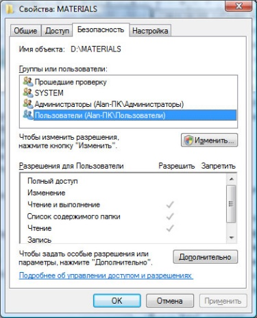
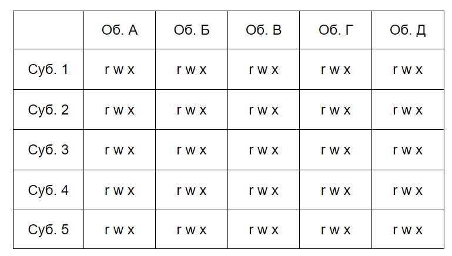
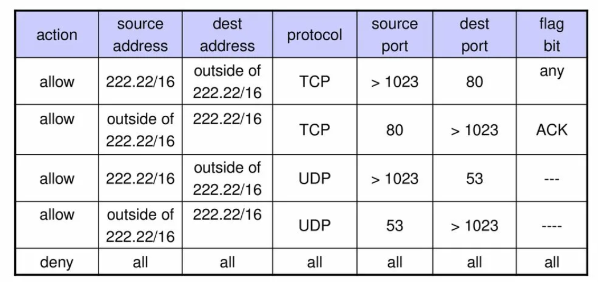

---
## Front matter
title: "Дискреционные модели доступа. Списки управления доступом."
subtitle: "Доклад"
author: "Надежда Александровна Рогожина"

## Generic otions
lang: ru-RU
toc-title: "Содержание"

## Bibliography
bibliography: bib/cite.bib
csl: pandoc/csl/gost-r-7-0-5-2008-numeric.csl

## Pdf output format
toc: true # Table of contents
toc-depth: 2
lof: true # List of figures
lot: true # List of tables
fontsize: 12pt
linestretch: 1.5
papersize: a4
documentclass: scrreprt
## I18n polyglossia
polyglossia-lang:
  name: russian
  options:
	- spelling=modern
	- babelshorthands=true
polyglossia-otherlangs:
  name: english
## I18n babel
babel-lang: russian
babel-otherlangs: english
## Fonts
mainfont: PT Serif
romanfont: PT Serif
sansfont: PT Sans
monofont: PT Mono
mainfontoptions: Ligatures=TeX
romanfontoptions: Ligatures=TeX
sansfontoptions: Ligatures=TeX,Scale=MatchLowercase
monofontoptions: Scale=MatchLowercase,Scale=0.9
## Biblatex
biblatex: true
biblio-style: "gost-numeric"
biblatexoptions:
  - parentracker=true
  - backend=biber
  - hyperref=auto
  - language=auto
  - autolang=other*
  - citestyle=gost-numeric
## Pandoc-crossref LaTeX customization
figureTitle: "Рис."
tableTitle: "Таблица"
listingTitle: "Листинг"
lofTitle: "Список иллюстраций"
lotTitle: "Список таблиц"
lolTitle: "Листинги"
## Misc options
indent: true
header-includes:
  - \usepackage{indentfirst}
  - \usepackage{float} # keep figures where there are in the text
  - \floatplacement{figure}{H} # keep figures where there are in the text
---

# Виды моделей управления доступом

Чтобы исключить несанкционированную эксплуатацию информационных ресурсов, каждой компании следует продумать и реализовать модель управления доступом. Нет универсального рецепта, какую именно использовать в том или ином случае – нужно опираться на тип и масштабность деятельности, количество сотрудников, требуемый уровень безопасности информационных объектов. Поэтому разберем все варианты моделей, их преимущества и минусы, инструменты для внедрения.
Что такое модели управления доступом?
Моделями называют системы распределения полномочий в информационной инфраструктуре компаний. Их ключевая задача – обеспечить необходимый уровень безопасности ресурсов и упростить контроль доступа. Основные четыре, уже показавшие свою эффективность для организаций в разных отраслях деятельности:
    1. Дискреционная
    2. Мандатная
    3. Ролевая
    4. Модель на базе атрибутов
В данном докладе я рассмотрю первую.

# Дискреционная модель

Дискреционная модель доступа DAC (Discretionary Access Control) имеет второе название – избирательная. Это метод управления, подразумевающий, что доступ к информационным системам и ресурсам назначает администратор (или реже владелец ресурсов). В рамках дискреционной модели контролируется доступ субъектов (пользователей или приложений) к объектам (представляющим собой различные информационные ресурсы: файлы, приложения, устройства вывода и т.д.). Для каждого объекта существует субъект-владелец, который сам определяет тех, кто имеет доступ к объекту, а также разрешенные операции доступа. Основными операциями доступа являются READ (чтение), WRITE (запись) и EXECUTE (выполнение, имеет смысл только для программ). Таким образом, в модели дискреционного доступа для каждой пары субъект-объект устанавливается набор разрешенных операций доступа. При необходимости список прав можно расширить.
При запросе доступа к объекту, система ищет субъекта в списке прав доступа объекта и разрешает доступ если субъект присутствует в списке и разрешенный тип доступа включает требуемый тип. Иначе доступ не предоставляется.
Классическая система дискреционного контроля доступа является «закрытой» в том смысле, что изначально объект не доступен никому, и в списке прав доступа описывается набор разрешений. Также существуют «открытые» системы, в которых по умолчанию все имеют полный доступ к объектам, а в списке доступа описывается набор ограничений.
Такая модель реализована в операционных системах Windows (см. рис. 1.) и Linux (рис. [-@fig:001]).

{#fig:001 width=70%}

В частности, в Linux для каждого файла (все ресурсы в ОС Linux представимы в виде файлов, в том числе устройства ввода-вывода) устанавливаются разрешения доступа для трех категорий субъектов: владелец файла, члены той же группы, что и владелец, и все остальные пользователи. Для каждой из этих категорий устанавливаются права на чтение (r), запись (w) и выполнение (x). Набор прав доступа объекта может быть представлен в виде символьной строки. Например, запись «rwxr-xr--» означает, что владелец файла может делать с ним все, что угодно; члены его группы могут читать и исполнять файл, но не могут записывать, а прочим пользователям доступно только чтение.
Преимущества такой схемы: простота реализации, совместимость с любым программным обеспечением, отсутствие сложностей в настройке. Недостаток модели DAC заключается в том, что субъект, имеющий право на чтение информации может передать ее другим субъектам, которые этого права не имеют, без уведомления владельца объекта. Таким образом, нет гарантии, что информация не станет доступна субъектам, не имеющим к ней доступа. Кроме того, не во всех АИС каждому объекту можно назначить владельца (во многих случаях данные принадлежат не отдельным субъектам, а всей системе), поэтому, как мне кажется дискреционная модель не подходит для крупных компаний с большим количеством сотрудников. В таких случаях нужна более универсальная и упорядоченная система.
Чаще всего отношения удобнее всего визуализировать в виде матрицы. Рассмотрим пример настройки матрицы доступа при организации дискреционной модели управления к объектам файловой системы (рис. [-@fig:002]).

{#fig:002 width=70%}

Собственно, исходя из этого, мы плавно переходим к такому понятию как «Списки контроля доступа».

# Списки контроля доступа (ACL)

Access Control List (ACL) — это список контроля доступом, с помощью которого для субъектов (чаще всего пользователей) устанавливаются допустимые операции с объектом. ACL определяет, какие операции с файлами, программами или процессами разрешено, или запрещено выполнять группе или конкретному пользователю. Главная функция списка контроля доступом — фильтрация сетевого трафика, особенно в настройках безопасности ПК.
Как работает ACL?
Каждый элемент ACL определяется как субъект или операция. Пользователи имеют различные уровни привилегий. Например, файловый объект имеет ACL (Игорь: delete; Алиса: read; Мария: read, write), это дает Игорю разрешение на удаление файла, Алисе — только на чтение, а Марии — на чтение и запись.
Списки контроля доступом работают как фильтры на коммутаторах и маршрутизаторах — ACL управляют доступом трафика в сеть. Также ACL встраивают в ОС и сетевые интерфейсы, где они фильтруют типы трафика в сети. Источник и пункт назначения трафика — основные параметры, по которым происходит фильтрация. ACL выполняют свою основную задачу благодаря идентификации и управлению поведением доступа к сети, управлению потоками трафика и гранулярному наблюдению. Поэтому у нас уменьшаются риски проникновения вирусов и вредоносного кода в организацию, захвата сети неподходящими службами и отказ в ресурсах нужным службам, а также риски утечки данных.

# Типы ACL

Существует четыре вида ACL:

- Стандартные ACL разрешают или запрещают пакеты только на основе IPv4-адреса источника. В них дополнительно используются номера 1300-1999 или 1-99 для определения маршрутизатором точного адреса источника информации. Стандартные ACL не так мощны, как расширенные, но используют меньше вычислительной мощности.
- Расширенные ACL позволяют разграничивать адреса поставки и назначения для определенных узлов или всей сети. С помощью расширенных списков управления доступом можно фильтровать трафик, поддерживаемый протоколами IP, TCP и других (ICMP, UDP).
- Рефлексивные ACL фильтруют трафик с помощью данных сеанса верхнего уровня. Узел в локальной сети отправляет TCP-запрос в интернет и получает TCP-ответ. Далее формируется дополнительный ACL, распознающий сгенерированные из локальной сети параметры сессий пользователей. Эти параметры служат основой для доступа.
- Динамические ACL надежны в отношении расширенных ACL, Telnet и аутентификации. Они дают администраторам возможность гибко настраивать доступ. Например, предоставить временный доступ пользователю или запретить доступ к маршрутизатору из интернета, но оставить возможность работать с ним группе пользователей (рис. [-@fig:003]).

{#fig:003 width=70%}

# Выводы

Возможны и смешанные варианты построения, когда одновременно в системе присутствуют как владельцы, устанавливающие права доступа к своим объектам, так и администратор, имеющий возможность изменения прав для любого объекта и (или) изменения его владельца. Именно такой смешанный вариант реализован в большинстве операционных систем, например, в классических UNIX-системах или в системах Windows семейства NT.
Дискреционное управление доступом является основной реализацией разграничительной политики доступа к ресурсам при обработке конфиденциальных сведений, согласно требованиям к системе защиты информации.

# Список литературы{.unnumbered}

::: {#refs}
:::
