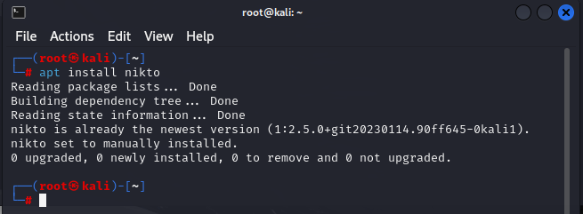
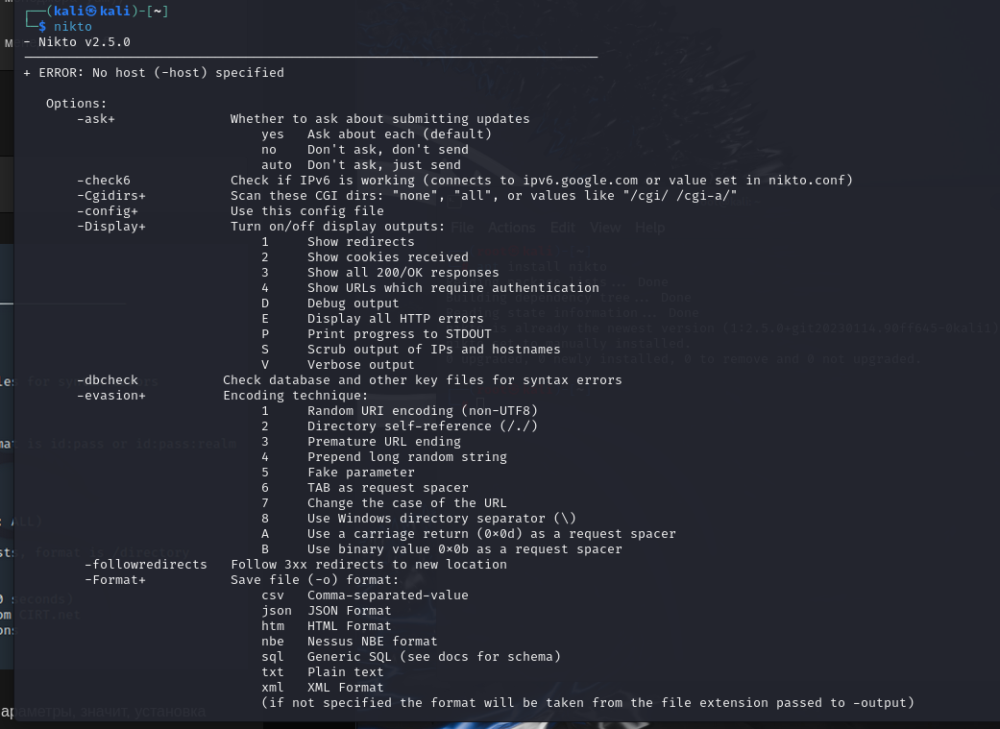
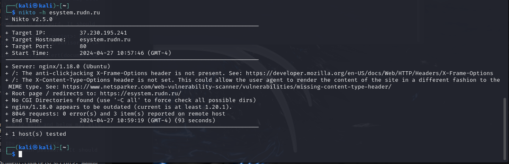
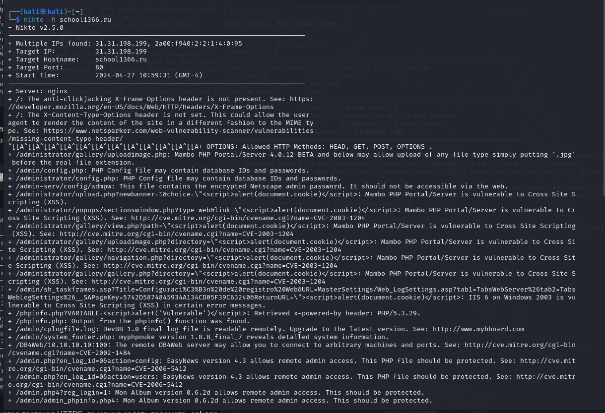
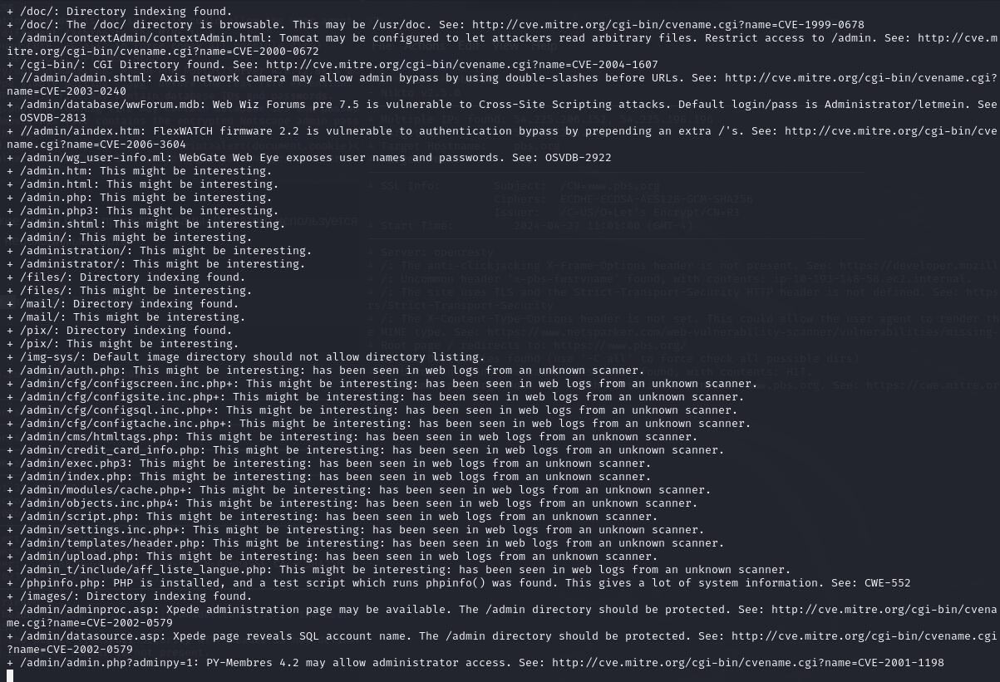
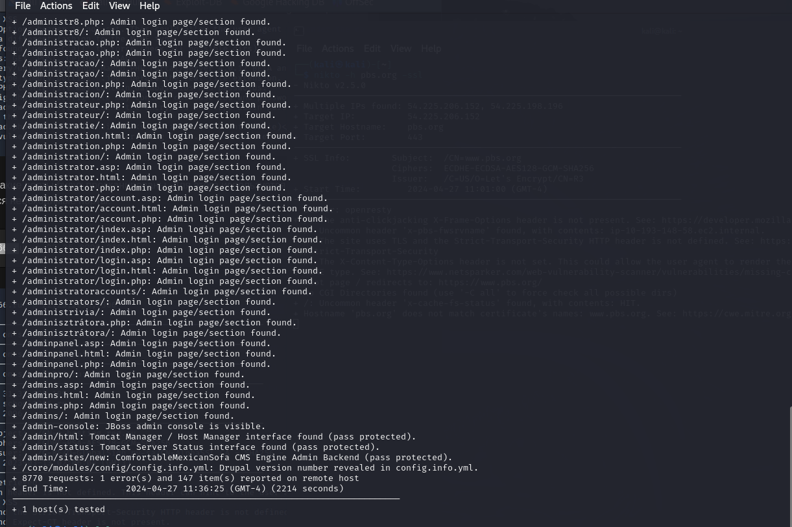

---
## Front matter
lang: ru-RU
title: Презентация по 4 этапу индивидуального проекта.
subtitle: Основы информационной безопасности.
author:
  - Рогожина Н.А.
institute:
  - Российский университет дружбы народов, Москва, Россия

date: 27 апреля 2024

## i18n babel
babel-lang: russian
babel-otherlangs: english

## Formatting pdf
toc: false
toc-title: Содержание
slide_level: 2
aspectratio: 169
section-titles: true
theme: metropolis
header-includes:
 - \metroset{progressbar=frametitle,sectionpage=progressbar,numbering=fraction}
 - '\makeatletter'
 - '\beamer@ignorenonframefalse'
 - '\makeatother'
---

# Информация

## Докладчик

:::::::::::::: {.columns align=center}
::: {.column width="70%"}

  * Рогожина Надежда Александровна
  * Студентка 2го курса, НКАбд-02-22
  * Компьютерные и информационные науки
  * Российский университет дружбы народов
  * [Github](https://github.com/MikoGreen/study_2023-2024_infosec)

:::
::: {.column width="30%"}

:::
::::::::::::::

# Цели работы

## Цели и задачи

- Получить начальные практические навыки работы с `nikto`

## Теоретическое введение

`nikto` — базовый сканер безопасности веб-сервера. Он сканирует и обнаруживает уязвимости в веб-приложениях, обычно вызванные неправильной конфигурацией на самом сервере, файлами, установленными по умолчанию, и небезопасными файлами, а также устаревшими серверными приложениями. Утилита относиться к классу blackbox сканеров, т. е. сканеров, использующих стратегию сканирования методом черного ящика. Это значит, что заранее неизвестно о внутреннем устройстве программы/сайта (доступ к исходному коду отсутствует) и упор сделан на функциональность. 

## Теоретическое введение

Программа может обнаруживать более 6700 потенциально опасных файлов и уязвимостей. Новые уязвимости добавляются в базу данных программы по мере их возникновения. Помимо поиска уязвимостей, сканер производит поиск на наличие устаревших версий, используемых библиотек и фреймворков. Nikto не позиционируется как стелс сканер (стелс сканеры никогда не устанавливают TCP-соединения до конца, тем самым сканирование происходит скрытно) – при сканировании сайта в логах сайта или в любой другой системе обнаружения вторжений, если она используется, будет отображена информация о том, что сайт подвергается сканированию.

Минимальный синттаксис для запуска сканирования выглядит следующим образом:

```
nikto -h [доменное_имя или IP_адрес]
```

Более подробно можно почитать в [тут](https://habr.com/ru/companies/first/articles/731696/) и [тут](https://habr.com/ru/companies/otus/articles/492546/).

# Выполнение

## Установка

1. От имени суперпользователя установим необходимую программу:

{#fig:001 width=70%}

## Изучение

2. Изучим справку по команде:

{#fig:002 width=40%}

## ТУИС

3. Протестируем сайт ТУИС:

{#fig:001 width=60%}

## Московская школа №1366

4. Протестируем сайт московской школы №1366:

{#fig:004 width=60%}

## Московская школа №1366

{#fig:005 width=60%}

## Московская школа №1366

{#fig:006 width=70%}

# Спасибо за внимание!

