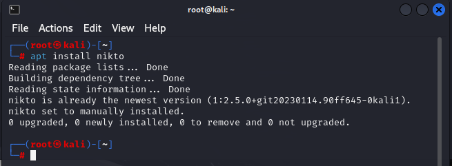
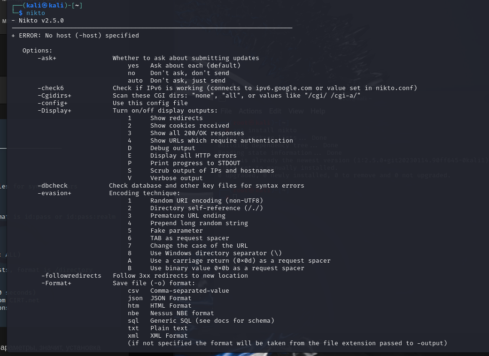
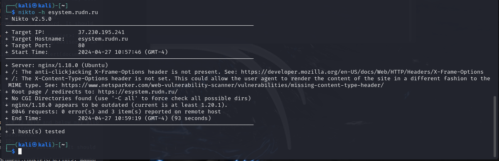
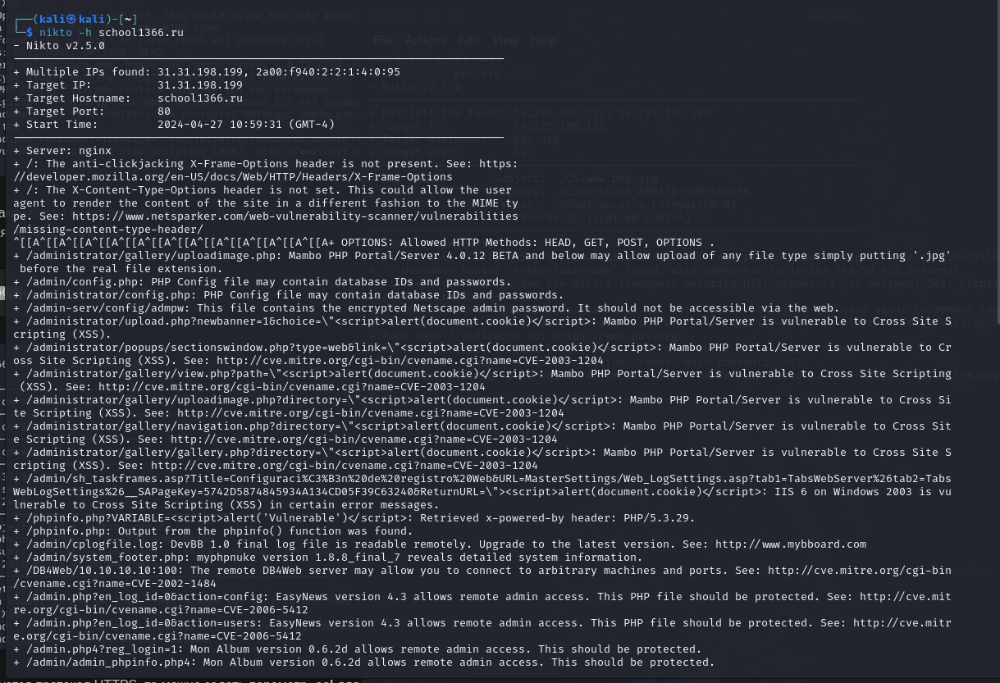
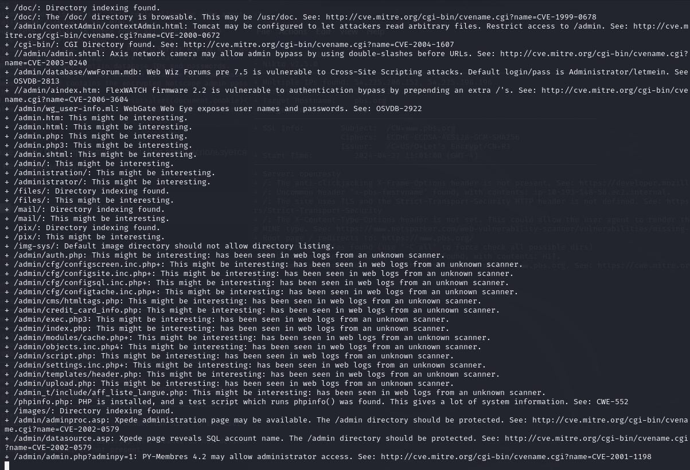
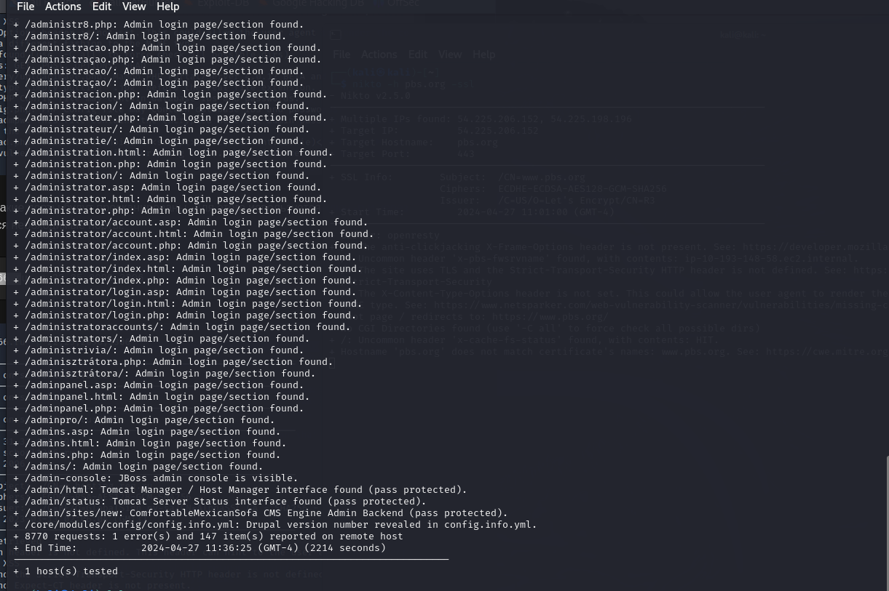

---
## Front matter
title: "Отчёт по индивидуальному проекту"
subtitle: "Этап 4"
author: "Надежда Александровна Рогожина"

## Generic otions
lang: ru-RU
toc-title: "Содержание"

## Bibliography
bibliography: bib/cite.bib
csl: pandoc/csl/gost-r-7-0-5-2008-numeric.csl

## Pdf output format
toc: true # Table of contents
toc-depth: 2
lof: true # List of figures
lot: true # List of tables
fontsize: 12pt
linestretch: 1.5
papersize: a4
documentclass: scrreprt
## I18n polyglossia
polyglossia-lang:
  name: russian
  options:
	- spelling=modern
	- babelshorthands=true
polyglossia-otherlangs:
  name: english
## I18n babel
babel-lang: russian
babel-otherlangs: english
## Fonts
mainfont: PT Serif
romanfont: PT Serif
sansfont: PT Sans
monofont: PT Mono
mainfontoptions: Ligatures=TeX
romanfontoptions: Ligatures=TeX
sansfontoptions: Ligatures=TeX,Scale=MatchLowercase
monofontoptions: Scale=MatchLowercase,Scale=0.9
## Biblatex
biblatex: true
biblio-style: "gost-numeric"
biblatexoptions:
  - parentracker=true
  - backend=biber
  - hyperref=auto
  - language=auto
  - autolang=other*
  - citestyle=gost-numeric
## Pandoc-crossref LaTeX customization
figureTitle: "Рис."
tableTitle: "Таблица"
listingTitle: "Листинг"
lofTitle: "Список иллюстраций"
lotTitle: "Список таблиц"
lolTitle: "Листинги"
## Misc options
indent: true
header-includes:
  - \usepackage{indentfirst}
  - \usepackage{float} # keep figures where there are in the text
  - \floatplacement{figure}{H} # keep figures where there are in the text
---

# Цель работы

Получить начальные практические навыки работы с `nikto`.

# Теоретическое введение

`nikto` — базовый сканер безопасности веб-сервера. Он сканирует и обнаруживает уязвимости в веб-приложениях, обычно вызванные неправильной конфигурацией на самом сервере, файлами, установленными по умолчанию, и небезопасными файлами, а также устаревшими серверными приложениями. Утилита относиться к классу blackbox сканеров, т. е. сканеров, использующих стратегию сканирования методом черного ящика. Это значит, что заранее неизвестно о внутреннем устройстве программы/сайта (доступ к исходному коду отсутствует) и упор сделан на функциональность. Программа может обнаруживать более 6700 потенциально опасных файлов и уязвимостей. Новые уязвимости добавляются в базу данных программы по мере их возникновения. Помимо поиска уязвимостей, сканер производит поиск на наличие устаревших версий, используемых библиотек и фреймворков. Nikto не позиционируется как стелс сканер (стелс сканеры никогда не устанавливают TCP-соединения до конца, тем самым сканирование происходит скрытно) – при сканировании сайта в логах сайта или в любой другой системе обнаружения вторжений, если она используется, будет отображена информация о том, что сайт подвергается сканированию.

Минимальный синттаксис для запуска сканирования выглядит следующим образом:

```
nikto -h [доменное_имя или IP_адрес]
```

Более подробно можно почитать в [тут](https://habr.com/ru/companies/first/articles/731696/) и [тут](https://habr.com/ru/companies/otus/articles/492546/).

# Выполнение

1. От имени суперпользователя установим необходимую программу (рис. [-@fig:001]):

{#fig:001 width=70%}

2. Изучим справку по команде (рис. [-@fig:002]):

{#fig:002 width=70%}

3. Протестируем сайт ТУИС (рис. [-@fig:003]):

{#fig:001 width=70%}

4. Протестируем сайт московской школы №1366 (рис. [-@fig:004], рис. [-@fig:005], рис. [-@fig:006]):

{#fig:004 width=70%}

{#fig:005 width=70%}

{#fig:006 width=70%}

# Список литературы{.unnumbered}

::: {#refs}
:::
