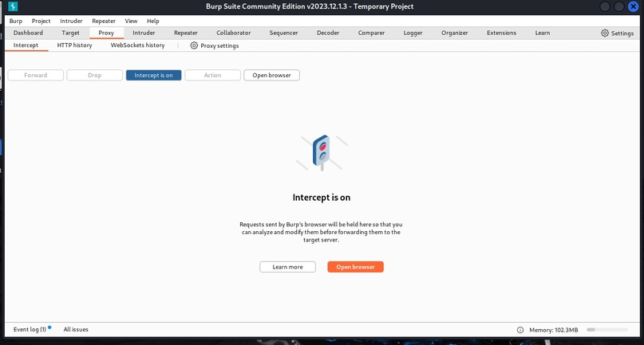
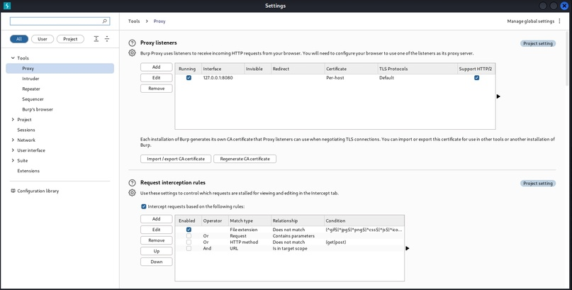
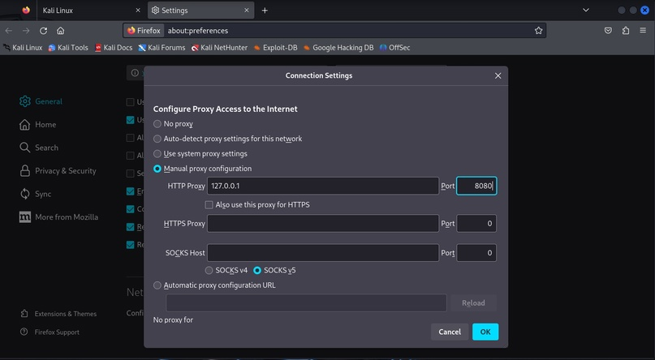
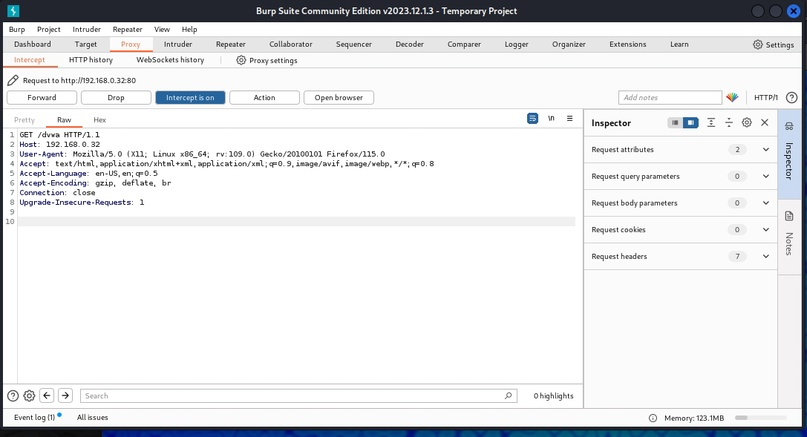
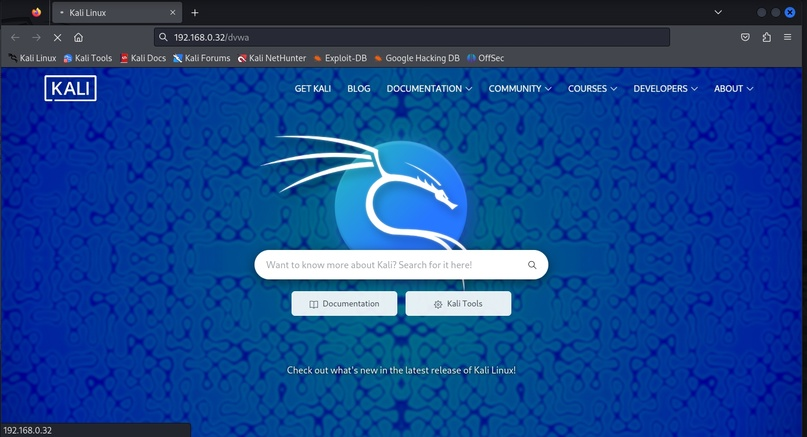
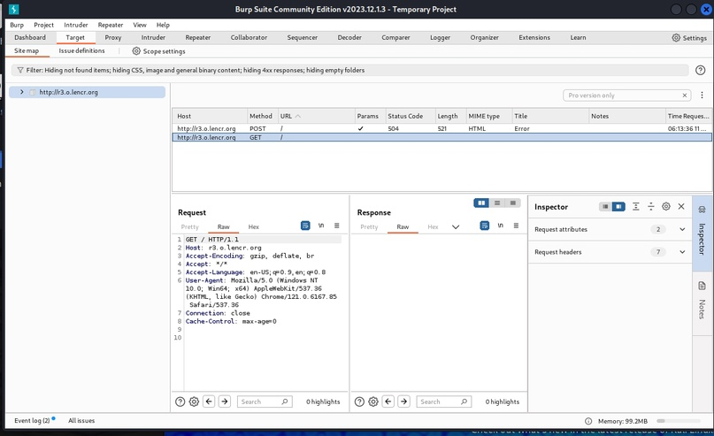

---
## Front matter
lang: ru-RU
title: Презентация по 5 этапу индивидуального проекта.
subtitle: Основы информационной безопасности.
author:
  - Рогожина Н.А.
institute:
  - Российский университет дружбы народов, Москва, Россия

date: 11 мая 2024

## i18n babel
babel-lang: russian
babel-otherlangs: english

## Formatting pdf
toc: false
toc-title: Содержание
slide_level: 2
aspectratio: 169
section-titles: true
theme: metropolis
header-includes:
 - \metroset{progressbar=frametitle,sectionpage=progressbar,numbering=fraction}
 - '\makeatletter'
 - '\beamer@ignorenonframefalse'
 - '\makeatother'
---

# Информация

## Докладчик

:::::::::::::: {.columns align=center}
::: {.column width="70%"}

  * Рогожина Надежда Александровна
  * Студентка 2го курса, НКАбд-02-22
  * Компьютерные и информационные науки
  * Российский университет дружбы народов
  * [Github](https://github.com/MikoGreen/study_2023-2024_infosec)

:::
::: {.column width="30%"}

:::
::::::::::::::

# Цели работы

## Цели и задачи

- Познакомиться с утилитой `Burp Suite`.

## Теоретическое введение

`Burp Suite` представляет собой набор мощных инструментов безопасности веб-приложений, которые демонстрируют реальные возможности злоумышленника, проникающего в веб-приложения.

# Выполнение

## Выполнение

В первую очередь, я запустила `burp suite` через команду `# burpsuite` в терминале. На вкладке `Proxy - Intercept` необходимо было включить перехват.

## Выполнение

{#fig:001 width=70%}

## Выполнение

Также необходимо было настроить `proxy`.

## Выполнение

{#fig:002 width=70%}

## Выполнение

После этого настроить сеть в браузере.

## Выполнение

{#fig:003 width=70%}

## Выполнение

Попытаемся подключиться к порту `192.168.0.32/dvwa`.

## Выполнение

{#fig:004 width=70%}

## Выполнение

Здесь мы получили первую информацию о ресурсе, к которому пытаемся подключиться. Нажимаем `Forward`. В этот момент, страница браузера продолжает загружаться.

{#fig:005 width=70%}

## Выполнение

Однако, в `target` мы видим нашу цель и первые данные, полученные через `burp suite`.

## Выполнение

{#fig:006 width=70%}

# Выводы

В ходе лабораторной работы мы познакомились с инструментом сканирования сайтов `Burp Suite`.

