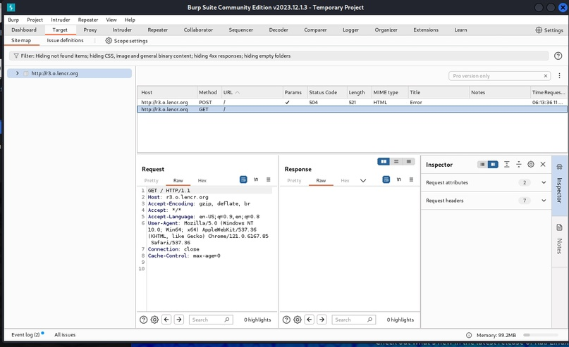

---
## Front matter
title: "Отчёт по индивидуальному проекту"
subtitle: "Этап 4"
author: "Надежда Александровна Рогожина"

## Generic otions
lang: ru-RU
toc-title: "Содержание"

## Bibliography
bibliography: bib/cite.bib
csl: pandoc/csl/gost-r-7-0-5-2008-numeric.csl

## Pdf output format
toc: true # Table of contents
toc-depth: 2
lof: true # List of figures
lot: true # List of tables
fontsize: 12pt
linestretch: 1.5
papersize: a4
documentclass: scrreprt
## I18n polyglossia
polyglossia-lang:
  name: russian
  options:
	- spelling=modern
	- babelshorthands=true
polyglossia-otherlangs:
  name: english
## I18n babel
babel-lang: russian
babel-otherlangs: english
## Fonts
mainfont: PT Serif
romanfont: PT Serif
sansfont: PT Sans
monofont: PT Mono
mainfontoptions: Ligatures=TeX
romanfontoptions: Ligatures=TeX
sansfontoptions: Ligatures=TeX,Scale=MatchLowercase
monofontoptions: Scale=MatchLowercase,Scale=0.9
## Biblatex
biblatex: true
biblio-style: "gost-numeric"
biblatexoptions:
  - parentracker=true
  - backend=biber
  - hyperref=auto
  - language=auto
  - autolang=other*
  - citestyle=gost-numeric
## Pandoc-crossref LaTeX customization
figureTitle: "Рис."
tableTitle: "Таблица"
listingTitle: "Листинг"
lofTitle: "Список иллюстраций"
lotTitle: "Список таблиц"
lolTitle: "Листинги"
## Misc options
indent: true
header-includes:
  - \usepackage{indentfirst}
  - \usepackage{float} # keep figures where there are in the text
  - \floatplacement{figure}{H} # keep figures where there are in the text
---

# Цель работы

Познакомиться с утилитой Burp Suite.

# Теоретическое введение

Burp Suite представляет собой набор мощных инструментов безопасности веб-приложений, которые демонстрируют реальные возможности злоумышленника, проникающего в веб-приложения.

# Выполнение лабораторной работы

В первую очередь, я запустила `burp suite` через команду `# burpsuite` в терминале. На вкладке `Proxy - Intercept` необходимо было включить перехват (рис. [-@fig:001]).

{#fig:001 width=70%}

Также необходимо было настроить `proxy` (рис. [-@fig:002]).

{#fig:002 width=70%}

После этого настроить сеть в браузере (рис. [-@fig:003]).

{#fig:003 width=70%}

Попытаемся подключиться к порту `192.168.0.32/dvwa` (рис. [-@fig:004]).

{#fig:004 width=70%}

Здесь мы получили первую информацию о ресурсе, к которому пытаемся подключиться. Нажимаем `Forward`. В этот момент, страница браузера продолжает загружаться (рис. [-@fig:005]).

{#fig:005 width=70%}

Однако, в `target` мы видим нашу цель и первые данные, полученные через `burp suite` (рис. [-@fig:006]).

{#fig:006 width=70%}

# Выводы

В ходе лабораторной работы мы познакомились с инструментом сканирования сайтов `Burp Suite`.

# Список литературы{.unnumbered}

::: {#refs}
:::
